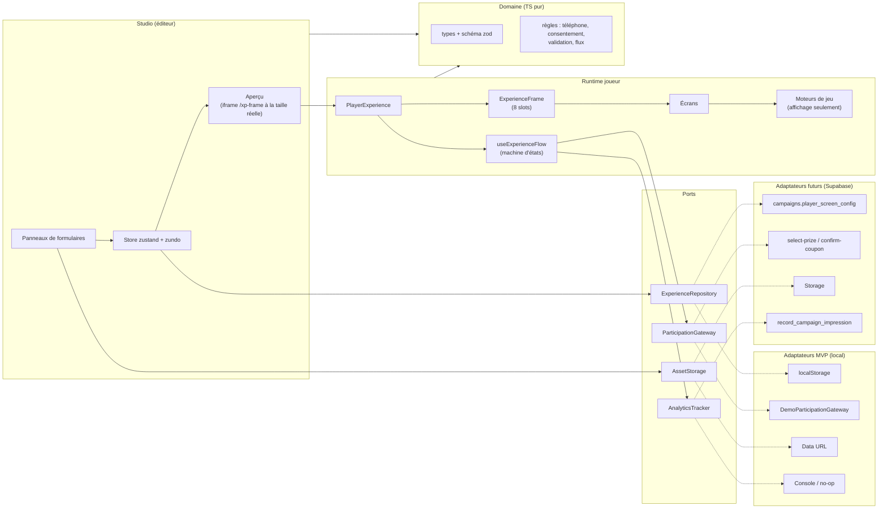
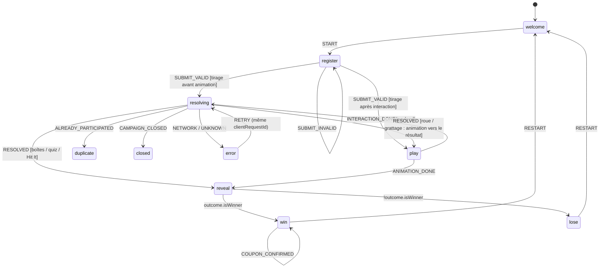

# Plan de refactorisation — Player Experience (éditeur + écrans joueur)

**Date :** 2026-09-17
**Branche de départ :** `Fix/PlayerScreenEditor`
**Nature :** MVP **100 % côté client**, conçu pour être **branché sur un backend plus tard** sans réécriture.
**Documents liés :**

- [`approche_actuel.md`](../analyse_des_approches/approche_actuel.md) — pourquoi abandonner le canvas libre
- [`approche_inspiration.md`](../analyse_des_approches/approche_inspiration.md) — analyse du prototype Aktera
- [`rules.md`](../rules.md) — règles à respecter à chaque tâche

**Révision du 2026-09-21 — responsive sur toutes les tailles d'écran.** Le runtime est rendu dans une iframe à la taille réelle de l'appareil ; sa mise en page s'adapte à la largeur, à la hauteur et à l'orientation ; l'aperçu du Studio fonctionne comme le mode appareil des DevTools ; la vérification passe de 4 formats à un balayage complet. Sections touchées : §1, §2.3, §3, §4, §5.1, §5.3, §6.5, §8.1–8.3, §8.6, §9.1, §9.3, §9.4, §10, §11, §13–§15. Détail : §2.3, §8.3 et §9.3.

**Révision du 2026-09-21 (2) — contenu du jeu et accroches de pregame.**

- Séparation stricte entre **règles** (lots, poids, questions et bonnes réponses, seuils, durées : campagne, éditées dans le Wizard, lues par le serveur) et **présentation** (affichage des lots par langue, segments de roue, traductions des questions, apparence : Studio), §6.6.
- `winThreshold`, `durationSeconds` et `secondsPerQuestion` sortent d'`ExperienceConfig`.
- La passerelle de démo applique les mêmes seuils que `resolve_game_outcome`.
- Spécification des **accroches de pregame** par jeu, §8.7.
- Sections touchées : §5.1, §5.2, §6.4–6.6, §7.3, §8.5–8.7, §9.2, §10.1, §11, §12.2, §13.3, §15.

---

## Sommaire

1. [Objectifs et périmètre](#1-objectifs-et-périmètre)
2. [État des lieux](#2-état-des-lieux)
3. [Principes d'architecture](#3-principes-darchitecture)
4. [Architecture cible](#4-architecture-cible)
5. [Modèle de données (`ExperienceConfig`)](#5-modèle-de-données-experienceconfig)
6. [Logique métier](#6-logique-métier)
7. [Contrats compatibles backend (ports et adaptateurs)](#7-contrats-compatibles-backend-ports-et-adaptateurs)
8. [Runtime joueur](#8-runtime-joueur)
9. [Studio (éditeur)](#9-studio-éditeur)
10. [Plan de réutilisation](#10-plan-de-réutilisation)
11. [Phases d'implémentation (MVP)](#11-phases-dimplémentation-mvp)
12. [Après le MVP : branchement backend](#12-après-le-mvp--branchement-backend)
13. [Qualité, tests et recette](#13-qualité-tests-et-recette)
14. [Risques et parades](#14-risques-et-parades)
15. [Décisions à valider](#15-décisions-à-valider)
16. [Annexes](#16-annexes)

---

## 1. Objectifs et périmètre

### 1.1 Objectifs

1. **Remplacer les trois systèmes actuels** (canvas `player-ui-maker`, portage partiel `player-editor`, écran `PlayerScreenConfig.tsx`) par **un seul module** : `src/features/player-experience/`.
2. **Reprendre au maximum le prototype Aktera** (`aktera---gamified-marketing-experience/`) :
   - la grammaire d'écran à 8 slots ;
   - les tokens de marque et les presets visuels ;
   - les textes par défaut fr/ar/en ;
   - les composants visuels (roue, grattage, boîtes, voucher…) ;
   - l'UX du Studio.
3. **Corriger et renforcer la logique métier** : consentement avant le jeu, résultat imposé par une « source d'autorité », anti-doublon, normalisation du téléphone, bugs de parcours.
4. **Personnalisation par formulaires uniquement** : template, marque, couleurs, fond, textes, sections, champs du formulaire, légal. **Pas de positionnement libre.**
5. **Préparer le backend** : contrats typés, adaptateurs interchangeables, configuration JSON versionnée, identifiants UUID, codes d'erreur alignés sur `select-prize`.
6. **Fonctionner sur toutes les tailles d'écran, pas sur une liste de formats** :
   - tout couple largeur × hauteur de l'enveloppe supportée (280–2560 × 320–1600 px), en portrait comme en paysage ;
   - un aperçu du Studio fidèle au pixel près, qui fonctionne comme le mode appareil des DevTools : appareils prédéfinis, redimensionnement libre, rotation et zoom (§8.3, §9.3).

### 1.2 Périmètre du MVP

| Inclus dans le MVP                                                                                                                                                                                                                     | Exclu du MVP                                                                                       |
| -------------------------------------------------------------------------------------------------------------------------------------------------------------------------------------------------------------------------------------- | -------------------------------------------------------------------------------------------------- |
| Nouveau module `player-experience` (domaine, services locaux, runtime, studio)                                                                                                                                                         | Toute modification Supabase : migrations, RLS, Edge Functions, RPC                                 |
| Persistance locale (`localStorage`) versionnée                                                                                                                                                                                         | Stockage des images dans Supabase Storage                                                          |
| Passerelle de participation **de démonstration** (serveur simulé en local)                                                                                                                                                             | Branchement de `/play/:slug` sur le nouveau runtime                                                |
| 5 mécaniques existantes : roue, grattage, boîtes mystère, quiz, Hit It                                                                                                                                                                 | Les 8 nouvelles mécaniques Aktera (duel, swipe, mood, persona, memory, explorer, guesser, catcher) |
| Studio complet : formulaires, aperçu multi-écran / multi-langue, **aperçu responsive façon DevTools** (catalogue d'appareils, mode Responsive redimensionnable, rotation, zoom, audit de mise en page), validation, import/export JSON | Publication, gestion brouillon/publié, collaboration                                               |
| Remplacement de l'onglet « Player Screen » et du simulateur de l'App                                                                                                                                                                   | Captcha réel, vérification des partages                                                            |
| Suppression du code mort et des dépendances inutiles                                                                                                                                                                                   |                                                                                                    |

> **La page publique `/play/:slug` n'est pas modifiée pendant le MVP.** Elle continue d'utiliser le vrai backend (`select-prize`, `confirm-coupon`). Le nouveau runtime y sera branché après le MVP ([§12](#12-après-le-mvp--branchement-backend)), via un adaptateur Supabase qui **réutilise les endpoints existants**.

### 1.3 Règles non négociables (`CLAUDE.md`) et leur traitement

| Règle                                                                              | Traitement dans ce plan                                                                                                                                                                                                                     |
| ---------------------------------------------------------------------------------- | ------------------------------------------------------------------------------------------------------------------------------------------------------------------------------------------------------------------------------------------- |
| Tirage du lot côté serveur uniquement                                              | Les moteurs de jeu **ne calculent jamais** le résultat : ils le **reçoivent**. Le seul tirage client est isolé dans `DemoParticipationGateway`, réservé à l'aperçu et à la démo, et **interdit** sur `/play/:slug` (garde explicite, §7.4). |
| RLS activée                                                                        | Aucun changement backend.                                                                                                                                                                                                                   |
| Consentement strict (loi 18-07)                                                    | Consentement **jamais pré-coché**, demandé **avant** la partie, enregistré (horodatage, version de la politique, langue).                                                                                                                   |
| Anti-doublon                                                                       | Clé normalisée (campagne + téléphone) dans la passerelle ; code d'erreur `ALREADY_PARTICIPATED` identique au serveur.                                                                                                                       |
| Libellés de l'interface en anglais ; arabe en `dir="auto"` avec _Noto Sans Arabic_ | Studio en anglais ; contenu joueur en fr/ar/en ; police arabe chargée et appliquée.                                                                                                                                                         |
| Serveur Vite en `0.0.0.0`                                                          | Inchangé.                                                                                                                                                                                                                                   |

---

## 2. État des lieux

### 2.1 Ce qui existe aujourd'hui

| Élément                               | Emplacement                                                        | Taille        | Utilisé en production ?                                                                          | Décision                                                      |
| ------------------------------------- | ------------------------------------------------------------------ | ------------- | ------------------------------------------------------------------------------------------------ | ------------------------------------------------------------- |
| Player UI Maker (canvas libre)        | `src/components/player-ui-maker/`                                  | ~9 400 lignes | Non                                                                                              | **Supprimer** en fin de MVP                                   |
| Portage Aktera partiel                | `src/components/player-editor/`                                    | ~5 900 lignes | Non (`PlayerEditorShell` n'est importé nulle part ; seul `AkteraSpinWheel` l'est, par le canvas) | **Récupérer** presets, i18n, audio et visuels, puis supprimer |
| Écran « Player Screen Customization » | `src/components/PlayerScreenConfig.tsx`                            | 231 lignes    | Non (bouton « Save » sans effet)                                                                 | **Supprimer**                                                 |
| Prototype AI Studio                   | `aktera---gamified-marketing-experience/`                          | ~7 200 lignes | Non                                                                                              | **Source principale de réutilisation**, puis archivage        |
| Flux joueur de production             | `src/pages/play/PlayerFlowPage.tsx` + `src/components/Player*.tsx` | ~3 000 lignes | **Oui**                                                                                          | **Conserver** pendant le MVP ; source du contrat métier       |
| Simulateur (tiroir) de l'App          | `src/App.tsx` (`showSandbox`, `mapCampaignToBrandPreset`)          | —             | Démo interne                                                                                     | **Remplacer** par le nouveau runtime en mode démo             |
| Contexte joueur                       | `src/contexts/PlayerContext.tsx`                                   | 104 lignes    | Non utilisé par `PlayerFlowPage`                                                                 | Remplacé par la machine d'états du module                     |
| Types de configuration                | `src/types.ts:156` (`PlayerScreenConfig`)                          | —             | Colonne JSONB `campaigns.player_screen_config`                                                   | **Étendre** avec une clé `experience` versionnée              |

### 2.2 Le contrat métier de production à préserver

Source : `src/pages/play/PlayerFlowPage.tsx`.

1. **Chargement** de la campagne et vérification qu'elle est active et que le stock n'est pas épuisé (sinon écran « fermée »).
2. **Inscription** (`PlayerLanding`) : nom, téléphone `0[567]XXXXXXXX`, consentement obligatoire — **avant** le jeu.
3. **Deux moments de tirage** selon la mécanique :
   - **avant l'animation** (`lucky_wheel`, `scratch_card`) : `select-prize` est appelé, puis la roue s'arrête sur le lot reçu (`PlayerGame` accepte `targetPrize`) ;
   - **après l'interaction** (`quiz`, `mystery_box`, `hit_it`) : `select-prize` est appelé avec un `game_payload` (`answers`, `selected_box_index`, `hits`).
4. **Erreurs métier** renvoyées par le serveur : `ALREADY_PARTICIPATED` → écran « déjà participé » ; `CAMPAIGN_CLOSED` → écran « fermée ».
5. **Résultat** (`PlayerResult`) : affichage et copie du code, puis `confirm-coupon` avec `entry_id`.
6. **Normalisation du téléphone** identique côté client et serveur (`normalizeDzPhone`, `PlayerFlowPage.tsx:380` et `select-prize/index.ts:25`).

### 2.3 Ce qu'on garde du prototype Aktera et ce qu'on corrige

- **À garder** : grammaire à 8 slots, tokens, presets de style, textes fr/ar/en, écran d'accueil « Midnight Gold » (la capture de référence), voucher, écran de consolation, règles UX (un seul CTA dominant, zone tactile ≥ 44 px, pas d'impasse).
- **À corriger** (détail dans l'analyse Aktera, §4) :
  - tirage côté client ;
  - consentement pré-coché et demandé après la partie ;
  - faux captcha ;
  - bouton de la roue qui bloque l'écran ;
  - défaite qui mène à l'écran de victoire ;
  - champ wilaya absent ;
  - police arabe non appliquée ;
  - contenu écrit en dur ;
  - marques réelles dans les presets ;
  - tailles fixes en pixels (roue, grattage, cadre, `min-h-[620px]`…) et 54 variantes `sm:`/`md:`/`lg:`/`xl:` dans 15 fichiers : dans un aperçu, elles suivraient la fenêtre du Studio et non l'appareil simulé (§8.3).

---

## 3. Principes d'architecture

1. **La configuration est de la donnée, pas du code.** `ExperienceConfig` est un JSON sérialisable : ni fonction, ni `ReactNode`, ni callback. Le prototype Aktera mélangeait les deux (`onPrimaryCta`, `ctaIcon` dans la configuration des slots) ; ici, le **contenu** vient de la configuration et le **comportement** vient de la machine d'états.
2. **La mise en page est du code.** Un template = un composant React responsive (colonne flex à 8 slots). L'utilisateur choisit et remplit ; il ne positionne rien.
3. **Architecture hexagonale légère (ports et adaptateurs).**
   - Le domaine (types, règles, machine d'états) ne dépend ni de React ni du stockage.
   - Les accès externes passent par des **interfaces** : `ExperienceRepository`, `ParticipationGateway`, `AssetStorage`, `AnalyticsTracker`, `HumanVerification`.
   - MVP : adaptateurs `local/`. Plus tard : adaptateurs `supabase/`, **sans toucher au runtime ni au Studio**.
4. **Autorité du résultat.** Un moteur de jeu reçoit `outcome` et ne fait qu'animer vers ce résultat. Il ne connaît ni probabilités, ni stock, ni codes.
5. **Tout est asynchrone dès maintenant.** Même en local, les ports renvoient des `Promise` et l'interface gère chargement, erreurs et nouvelle tentative. Passer au réseau ne changera rien à l'UI.
6. **Validation aux frontières.** Toute configuration chargée ou importée passe par un schéma (`zod`) et une chaîne de migrations (`schemaVersion`).
7. **Conventions alignées sur le backend.**
   - camelCase dans l'app, snake_case uniquement dans les adaptateurs (comme `src/hooks/useCampaigns.ts`) ;
   - identifiants UUID (`crypto.randomUUID()`), dates ISO 8601 ;
   - codes d'erreur identiques à `select-prize`.
8. **Un seul moteur de rendu** pour l'aperçu du Studio, le simulateur de l'App et, plus tard, `/play/:slug`.
9. **Accessibilité et performance mobile par défaut** : `prefers-reduced-motion`, zones tactiles ≥ 44 px, états jamais signalés par la couleur seule, animations désactivables.
10. **Le runtime possède son viewport.**
    - Il est toujours rendu dans un document qui lui appartient : la page elle-même en production, une `<iframe>` de même origine (route `/xp-frame`) à la **taille CSS exacte** de l'appareil dans le Studio et le simulateur.
    - Le zoom de l'aperçu est un `transform: scale()` appliqué **autour** de l'iframe : il ne change jamais la mise en page.
    - Media queries, `dvh`, `position: fixed`, défilement et focus se comportent donc comme sur l'appareil. C'est ce que fait le mode appareil des DevTools.
    - Le runtime n'a qu'**un seul mode de rendu** (document plein) : jamais de rendu direct dans une `div` d'une autre page.
11. **Le responsive se définit par largeur × hauteur × orientation, pas par une liste de formats.**
    - Enveloppe supportée : 280–2560 × 320–1600 px.
    - Les points de rupture ont une source unique (`runtime/layout/breakpoints.ts`), partagée par le CSS du runtime, la règle de l'aperçu et le script de vérification.
    - La qualité se vérifie par **balayage** de l'enveloppe, pas par échantillons.
12. **Un rendu très beau et une expérience de haut niveau.**
    - Le prototype Aktera, ou le portage `player-editor` quand il est plus abouti, est le **plancher** visuel : chaque écran et chaque jeu doit être au moins aussi beau et aussi vivant.
    - On fait mieux dès que possible.
    - Pour les jeux, la parité visuelle est obligatoire.
    - Détail vérifiable : [`rules.md`](../rules.md) §6, qui couvre la signature de chaque jeu et de chaque écran, le système visuel, le mouvement, l'UX, le Studio et la vérification.

---

## 4. Architecture cible

### 4.1 Vue d'ensemble



### 4.2 Arborescence cible

```
src/features/player-experience/
├─ index.ts                          # API publique du module (seuls exports utilisés ailleurs)
├─ README.md                         # règles du module (autorité du résultat, conventions)
│
├─ domain/                           # TypeScript pur — aucun import React
│  ├─ types.ts                       # ExperienceConfig, ThemeTokens, ScreenContent, FormConfig…
│  ├─ schema.ts                      # schémas zod + parseExperienceConfig()
│  ├─ defaults.ts                    # createDefaultExperience(gameType, campaign?)
│  ├─ migrations.ts                  # montées de schemaVersion + import de l'ancien PlayerScreenConfig
│  ├─ locale.ts                      # Locale, LocalizedText, resolveText(), getDirection()
│  ├─ phone.ts                       # normalizeDzPhone(), isValidDzMobile()
│  ├─ gameTypes.ts                   # GameType, OUTCOME_TIMING, libellés
│  ├─ participation.ts               # DrawRequest, DrawResult, GamePayload, codes d'erreur
│  ├─ flow.ts                        # machine d'états (état, événements, reducer, gardes)
│  ├─ validation.ts                  # contrôle du design : contraste, longueurs, légal obligatoire
│  └─ campaign.ts                    # CampaignSnapshot (modèle de lecture fourni au runtime)
│
├─ services/
│  ├─ ports.ts                       # interfaces des 5 ports
│  ├─ ServicesProvider.tsx           # contexte + useExperienceServices()
│  ├─ createLocalServices.ts         # composition des adaptateurs MVP
│  ├─ local/
│  │  ├─ localExperienceRepository.ts
│  │  ├─ demoParticipationGateway.ts # « serveur » simulé — démo uniquement
│  │  ├─ demoDrawEngine.ts           # tirage pondéré + stock + probabilité de gain
│  │  ├─ demoEntryStore.ts           # anti-doublon et participations de démo
│  │  ├─ scriptedParticipationGateway.ts # résultat forcé (aperçu gain/perte)
│  │  ├─ dataUrlAssetStorage.ts      # upload → data URL compressée
│  │  ├─ consoleAnalyticsTracker.ts
│  │  └─ noopHumanVerification.ts
│  └─ supabase/                      # APRÈS LE MVP (vide, avec README du contrat attendu)
│
├─ theme/
│  ├─ tokens.ts                      # ThemeTokens → variables CSS (--xp-*)
│  ├─ ThemeScope.tsx                 # applique les variables et la direction à un sous-arbre
│  ├─ backgrounds.ts                 # solid / gradient / mesh / dots / image
│  └─ fonts.ts                       # familles de polices (Poppins, Noto Sans Arabic)
│
├─ presets/
│  ├─ themePresets.ts                # Midnight Gold, Obsidian Violet, Clean Light… (génériques)
│  ├─ contentDefaults.ts             # textes fr/ar/en (ex-UI_STRINGS d'Aktera)
│  ├─ wilayas.ts                     # liste des 58 wilayas (ex-aktera-i18n)
│  ├─ icons.ts                       # icônes autorisées (lucide) : nom → composant
│  └─ devices.json                   # catalogue d'appareils de l'aperçu (JSON : lu aussi par le script de balayage)
│
├─ runtime/
│  ├─ PlayerExperience.tsx           # composant racine joueur
│  ├─ useExperienceFlow.ts           # reducer du domaine + appels à ParticipationGateway
│  ├─ layout/                        # mise en page adaptative (§8.3)
│  │  ├─ breakpoints.ts              # ENVELOPE + BREAKPOINTS : source unique des points de rupture
│  │  ├─ layoutMode.ts               # computeLayoutMode(w, h) → stack|split × tight|regular|roomy (pur)
│  │  ├─ useLayoutMode.ts            # matchMedia sur le viewport du document
│  │  ├─ layout.css                  # variantes Tailwind v4 : split, tight, roomy, compact, wide
│  │  ├─ safeArea.ts                 # --xp-safe-* + viewport-fit=cover
│  │  ├─ useElementSize.ts           # ResizeObserver (moteurs à canvas)
│  │  └─ layoutAudit.ts              # détection des défauts de mise en page (Studio + script)
│  ├─ host/                          # le runtime dans son propre document (principe 10)
│  │  ├─ FrameHost.tsx               # page /xp-frame chargée dans l'iframe d'aperçu
│  │  ├─ previewBridge.ts            # protocole postMessage Studio ⇄ cadre (origine vérifiée)
│  │  └─ fixtures.ts                 # configurations de test (pages de contrôle, script)
│  ├─ frame/
│  │  ├─ ExperienceFrame.tsx         # colonne à 8 slots (ex-SlotContainer)
│  │  └─ slots/                      # BrandHeader, HeroVisual, Title, SupportingCopy,
│  │                                 # PrimaryInteraction, Reinforcement, CtaBar, FooterUtility
│  ├─ sections/                      # JackpotCard, PrizeChips
│  ├─ screens/                       # Welcome, Register, Play, Resolving, Win, Lose, Status
│  ├─ games/
│  │  ├─ types.ts                    # contrat GameEngine
│  │  ├─ registry.ts                 # GameType → moteur
│  │  ├─ wheel/                      # WheelEngine + WheelTeaser
│  │  ├─ scratch/
│  │  ├─ boxes/
│  │  ├─ quiz/
│  │  └─ hitIt/
│  ├─ legal/TermsSheet.tsx           # feuille des mentions légales
│  ├─ feedback/                      # confettis, sons (ex-aktera-audio), toasts
│  └─ hooks/                         # useReducedMotion, useCopyToClipboard, useSessionId
│
└─ studio/
   ├─ PlayerExperienceStudio.tsx     # écran plein de l'éditeur
   ├─ store.ts                       # zustand + zundo (annuler / rétablir)
   ├─ useAutosave.ts
   ├─ layout/                        # StudioShell, StudioTopBar, StudioNav, PreviewPane
   ├─ preview/                       # aperçu façon DevTools (§9.3)
   │  ├─ PreviewViewport.tsx         # iframe à la taille CSS exacte + zoom par transform
   │  ├─ DeviceToolbar.tsx           # appareil, largeur × hauteur, zoom, rotation, cadre
   │  ├─ ResizableViewport.tsx       # poignées de redimensionnement (mode Responsive)
   │  ├─ BreakpointRuler.tsx         # règle cliquable des points de rupture
   │  ├─ DeviceChrome.tsx            # coque visuelle (encoche, barre d'état), sans dimension en dur
   │  ├─ viewportMath.ts             # bornage, zoom Fit, delta de pointeur, rotation (pur)
   │  ├─ customDevices.ts            # appareils personnalisés (localStorage)
   │  └─ viewportPrefs.ts            # préférences d'aperçu par utilisateur (localStorage)
   ├─ panels/                        # Template, Brand, Content, Sections, Form, Game, Legal, Share
   ├─ fields/                        # ColorField, ImageField, LocalizedTextField, ToggleField,
   │                                 # SelectField, ListEditor, IconPicker, SegmentedControl
   └─ validation/ValidationPanel.tsx
```

### 4.3 Dépendances entre couches

| Couche               | Peut importer                                                    | Ne doit jamais importer                          |
| -------------------- | ---------------------------------------------------------------- | ------------------------------------------------ |
| `domain/`            | rien (sauf `zod`)                                                | React, `services`, `runtime`, `studio`, Supabase |
| `services/`          | `domain`                                                         | `runtime`, `studio`                              |
| `theme/`, `presets/` | `domain`                                                         | `services`, `studio`                             |
| `runtime/`           | `domain`, `theme`, `presets`, `services/ports` (via le contexte) | `studio`, adaptateurs concrets                   |
| `studio/`            | tout le module                                                   | adaptateurs concrets (injectés par le provider)  |
| Reste de l'app       | `index.ts` du module uniquement                                  | fichiers internes                                |

> Garde-fou : une règle ESLint `no-restricted-imports` pourra interdire `src/features/player-experience/*/…` depuis l'extérieur et `services/local` depuis `runtime`.

---

## 5. Modèle de données (`ExperienceConfig`)

### 5.1 Types (esquisse)

```ts
// domain/locale.ts
export type Locale = "fr" | "ar" | "en";
export type LocalizedText = Partial<Record<Locale, string>>;

// domain/types.ts
export type AssetRef =
  | { kind: "dataUrl"; url: string } // MVP
  | { kind: "remote"; url: string } // URL https saisie
  | { kind: "storage"; bucket: string; path: string } // futur (Supabase Storage)
  | null;

export interface ThemeTokens {
  presetId: string | null;
  mode: "dark" | "light";
  colors: {
    primary: string; // CTA, accents
    secondary: string; // segments, dégradés
    accent: string; // états positifs, détails
    surface: string; // fond de base
    text: string; // texte principal
  };
  background: {
    kind: "solid" | "gradient" | "mesh" | "dots" | "image";
    image: AssetRef;
    overlayOpacity: number; // 0–1, lisibilité au-dessus d'une image
    focus: { x: number; y: number }; // 0–100 : point d'intérêt, conservé quel que soit le recadrage (portrait / paysage)
  };
  radius: "sharp" | "rounded" | "pill";
  font: "poppins" | "plus-jakarta"; // l'arabe utilise toujours Noto Sans Arabic
}

export interface ScreenContent {
  showHeader: boolean;
  hero: "none" | "badge" | "trophy" | "gift" | "timer";
  title: LocalizedText; // 2 lignes max (validation)
  subtitle: LocalizedText;
  reinforcement: {
    kind: "none" | "attempts" | "timer" | "progress" | "hint";
    text: LocalizedText;
  };
  primaryCta: LocalizedText;
  secondaryCta: LocalizedText | null;
}

export type ScreenKey = "welcome" | "register" | "play" | "win" | "lose";

export interface JackpotSection {
  enabled: boolean;
  eyebrow: LocalizedText; // « GRAND JACKPOT »
  title: LocalizedText; // « 5 000 DA Cash • 10 Go • Bons »
  badge: LocalizedText; // « Gagnant » (vide = masqué)
  icon: IconName;
}

export interface PrizeChipsSection {
  enabled: boolean;
  items: Array<{
    id: string;
    icon: IconName;
    value: LocalizedText;
    caption: LocalizedText;
    tone: "primary" | "secondary" | "accent";
  }>; // 1 à 4
}

export type FormFieldKey = "fullName" | "phone" | "email" | "wilaya";

export interface FormConfig {
  fields: Array<{
    key: FormFieldKey;
    enabled: boolean; // phone : toujours true (verrouillé)
    required: boolean; // phone : toujours true (verrouillé)
    label: LocalizedText;
    placeholder: LocalizedText;
  }>;
  consent: {
    text: LocalizedText; // toujours affiché, jamais pré-coché
    policyVersion: string; // ex. "2026-09-01"
  };
}

export interface LegalConfig {
  organizerName: string;
  links: Array<{
    id: string;
    kind: "terms" | "privacy" | "support" | "url";
    label: LocalizedText;
    url?: string; // uniquement https:, mailto:, tel:
  }>;
  legalLine: LocalizedText; // bandeau / mention courte du footer
  termsBody: LocalizedText; // contenu de la feuille « Mentions légales »
}

// PRÉSENTATION du jeu uniquement. Les règles qui décident du gain (lots, poids, stock,
// probabilité, questions et bonnes réponses, seuils, durées) vivent dans la campagne (§6.6).
export interface GameSettings {
  type: GameType; // = Campaign.gameType (choisi dans le Wizard, pas dans le Studio)
  teaser: {
    mode: "attract" | "static"; // simulation animée en pregame, ou image fixe (§8.7)
    caption: LocalizedText | null; // null = légende générée depuis la campagne (« 3 questions », « 5 lots à gagner »…)
  };
  wheel?: {
    segments: Array<{
      // 4 à 12 segments, tous de même taille visuelle
      id: string;
      prizeId: string | null; // lot de la campagne (prizes.id) ; null = segment « perdu »
      label: LocalizedText; // ≤ 14 caractères conseillés ; vide = libellé d'affichage du lot
      color: string | null; // null = couleur dérivée du thème
      icon: IconName | null;
    }>;
    hubLabel: LocalizedText; // « PLAY »
  };
  scratch?: {
    coverImage: AssetRef;
    revealThresholdPercent: number;
    coverText: LocalizedText;
  };
  boxes?: { count: 3; icon: IconName; color: string | null };
  quiz?: {
    // Traductions des questions de la campagne (la base ne stocke qu'une langue).
    // Jamais la bonne réponse : seulement du texte à afficher.
    translations: Record<
      string /* quiz_questions.id */,
      {
        sourceHash: string; // empreinte du texte source : détecte une traduction périmée après modification dans le Wizard
        text: LocalizedText;
        options: LocalizedText[]; // même nombre et même ordre que les options en base
      }
    >;
  };
  hitIt?: { targetIcon: IconName; targetImage: AssetRef };
}

// Affichage des lots de la campagne, par langue (la base ne stocke qu'un nom et un message).
export interface PrizeDisplay {
  label: LocalizedText; // vide = prizes.name
  winMessage: LocalizedText; // vide = prizes.win_message
  icon: IconName | null;
  image: AssetRef;
}

export interface ExperienceConfig {
  schemaVersion: 1;
  id: string; // UUID
  campaignId: string | null;
  templateId: "eight-slot"; // un seul template au MVP
  updatedAt: string; // ISO 8601
  locales: { default: Locale; enabled: Locale[] };
  theme: ThemeTokens;
  brand: {
    name: string;
    logo: AssetRef;
    logoIcon: IconName;
    tagline: LocalizedText;
  };
  screens: Record<ScreenKey, ScreenContent>;
  sections: { jackpot: JackpotSection; prizeChips: PrizeChipsSection };
  form: FormConfig;
  legal: LegalConfig;
  game: GameSettings;
  prizeDisplay: Record<string /* prizes.id */, PrizeDisplay>;
  features: {
    sound: boolean;
    animations: boolean;
    shareBonus: false; // verrouillé à false tant que le serveur ne le vérifie pas
  };
}
```

### 5.2 Modèle de lecture fourni au runtime (`CampaignSnapshot`)

Le runtime ne reçoit **jamais** de probabilités, de stock, de codes ni de bonnes réponses :

```ts
export interface CampaignSnapshot {
  id: string;
  name: string;
  gameType: GameType;
  status: "active" | "paused" | "draft" | "archived";
  prizes: Array<{ id: string; name: string; winMessage: string | null }>;
  quiz: Array<{ id: string; text: string; options: string[] }>; // sans la bonne réponse, dans l'ordre `position`
  // Règles publiques du jeu : affichables au joueur (« Touchez 8 fois en 10 s »), jamais secrètes.
  // Source unique : campaigns.game_logic_config, déjà lu par la RPC resolve_game_outcome.
  rules: {
    quiz?: { passThresholdPercent: number; secondsPerQuestion: number }; // pass_threshold_percentage (défaut 100, comme la RPC) ; 0 = sans chrono
    hitIt?: { winThreshold: number; durationSeconds: number }; // win_threshold ; durée 10 s comme PlayerHitIt aujourd'hui
  };
}
```

- **Démo / aperçu :** construit à partir de `useCampaigns` (lecture existante) par `buildCampaignSnapshot(campaign)`, ou d'une campagne fictive.
- **Plus tard :** construit à partir de la requête publique de `/play/:slug`.
- **Les données sensibles au tirage** (poids, quantités, `winProbability`, bonnes réponses du quiz) ne sont fournies **qu'à la passerelle de démo** (`buildDemoRules(campaign)`), jamais au runtime.
- `secondsPerQuestion` et `durationSeconds` sont lus dans `game_logic_config` (`quiz_seconds_per_question`, `hit_it_duration_seconds`) avec ces valeurs par défaut tant que le Wizard ne les expose pas (§12.2). Ce sont des règles : elles changent la difficulté, donc les chances de gagner.

### 5.3 Stockage et versionnement

- **Clé de stockage MVP :** `xp:experience:v1:<campaignId | "standalone">`.
- **Compatibilité future :** la configuration ira dans `campaigns.player_screen_config.experience` (colonne JSONB existante, **aucune migration SQL nécessaire**). `src/types.ts` : ajouter `experience?: ExperienceConfig` à `PlayerScreenConfig`. `uiProject` devient obsolète.
- **Chargement :** `parseExperienceConfig(raw)` enchaîne détection de version, migrations successives, validation `zod`, puis complète avec les valeurs par défaut.
- **Import de l'ancien format :** `importLegacyPlayerScreenConfig()` reprend au mieux `theme` (couleurs, logo, fond, arrondis, mode) et `content` (titres, champs) de l'ancien `PlayerScreenConfig`. `uiProject` est ignoré.
- **Taille :** les images en data URL sont compressées selon leur usage (fond : 1920 px sur le grand côté, pour rester net sur les grands écrans ; logo : 512 px ; couverture de grattage : 1280 px ; WebP/JPEG ≈ 0,8) et limitées à ~400 Ko par image, avec un avertissement dans le Studio. Le quota `localStorage` (~5 Mo) est vérifié à l'enregistrement, avec une erreur explicite.

---

## 6. Logique métier

### 6.1 Parcours joueur (machine d'états)



**Règles :**

- **Ordre imposé :** accueil → inscription + consentement → jeu → résultat. C'est l'ordre de la production et il est conforme à la loi 18-07. Le prototype Aktera, qui plaçait le formulaire après la partie, est corrigé.
- **Moment du tirage par mécanique :**

  | `GameType`     | Moment du tirage    | `GamePayload` envoyé               |
  | -------------- | ------------------- | ---------------------------------- |
  | `lucky_wheel`  | avant l'animation   | `{ kind: "none" }`                 |
  | `scratch_card` | avant l'animation   | `{ kind: "none" }`                 |
  | `quiz`         | après l'interaction | `{ kind: "quiz", answers }`        |
  | `mystery_box`  | après l'interaction | `{ kind: "boxes", selectedIndex }` |
  | `hit_it`       | après l'interaction | `{ kind: "hitIt", hits }`          |

- **Un seul CTA pilote l'état.** Le bouton du slot 7 **déclenche un événement** de la machine d'états, et le moteur **réagit à l'état**. Cela corrige le bug Aktera où le bouton mettait `isSpinning` à vrai sans lancer la roue.
- **Pas d'impasse :** chaque état propose une sortie (réessayer, recommencer, fermer, liens légaux).
- **`RESTART` ne contourne pas l'anti-doublon :** une nouvelle participation avec le même téléphone renvoie `ALREADY_PARTICIPATED`.
- **Reducer pur** (`domain/flow.ts`) testé unitairement. Le hook `useExperienceFlow` orchestre les effets : appels à la passerelle, analytics, minuteries.

### 6.2 Inscription et consentement

- **Champs configurables** : nom, téléphone, email, wilaya.
  - Téléphone **toujours actif et requis** (clé d'unicité).
  - Wilaya : liste des 58 wilayas (`presets/wilayas.ts`, reprise de `ALGERIA_WILAYAS`).
- **Téléphone :**
  - `normalizeDzPhone()` est la **copie exacte** de la fonction serveur (`select-prize/index.ts:25`) : `+213XXXXXXXXX` → `0XXXXXXXXX`, 9 chiffres commençant par 5/6/7 → préfixe `0`.
  - Validation : `/^0[567]\d{8}$/` après normalisation.
  - Saisie tolérante (espaces, tirets, `+213`) et affichage formaté.
  - Tests unitaires partagés : les mêmes cas serviront à vérifier la fonction serveur plus tard.
- **Consentement :**
  - case **non cochée** par défaut, bouton de soumission désactivé tant qu'elle ne l'est pas ;
  - lien vers la feuille des mentions légales ;
  - enregistrement d'un `ConsentRecord` : `{ accepted: true, acceptedAt, policyVersion, locale }`.
- **Suppression du faux captcha.** Le port `HumanVerification` est prévu (no-op au MVP), prêt pour Turnstile ou hCaptcha plus tard.
- **Messages d'erreur** traduits (fr/ar/en), associés au champ, et annoncés aux lecteurs d'écran (`aria-live`).

### 6.3 Résultat et coupon

- **Victoire :**
  - nom du lot, message du lot (`winMessage`), code (s'il existe), bouton « Copier » ;
  - bouton « J'ai copié mon code » qui appelle `confirmCoupon(entryId)`.
- **Défaite :** écran de consolation. Le « +1 essai par partage » est **désactivé** (`features.shareBonus = false`). Le partage simple (WhatsApp, copie du lien) reste possible, **sans** nouvel essai.
- **Codes :**
  - jamais présents dans la configuration ni dans le bundle ;
  - en démo, générés au format `DEMO-XXXX-XXXX`, pour qu'on ne les confonde pas avec de vrais codes.
- **Promesses marketing** (« Gain garanti », « 100 % gagnant ») : affichées uniquement si la campagne les permet. La validation du Studio avertit si ces textes sont présents alors que la probabilité de gain est inférieure à 100 %.

### 6.4 Roue : relier segments et lots

- **Construction :** les segments sont construits à partir de `game.wheel.segments`. Chaque segment référence un `prizeId` de la campagne, ou `null` pour un segment « perdu ».
- **Arrêt :** à la réception du résultat, la roue s'arrête sur **un** segment dont le `prizeId` correspond au lot gagné, ou sur un segment `null` en cas de défaite, choisi au hasard **parmi les segments compatibles** (choix purement visuel).
- **Incohérences :**
  - aucun segment ne correspond au lot → le Studio signale une erreur de validation ;
  - au runtime, repli sur un segment neutre avec le vrai nom du lot affiché ensuite.
- **Génération par défaut :** un segment par lot actif + un segment « perdu » (même logique que `LOSER_SLOT` en production).
- **Personnalisation par la marque (Studio) :**
  - de 4 à 12 segments, réordonnables ;
  - un même lot peut apparaître sur plusieurs segments, et plusieurs segments « perdu » peuvent porter des libellés différents (« Rejouez », « Presque ! ») ;
  - pour chaque segment : libellé fr/ar/en, couleur, icône.
- **Taille visuelle :** tous les segments ont la même taille. Elle ne représente **pas** la probabilité, qui dépend des poids fixés dans le Wizard.
- **Alignement avec le serveur :**
  - `resolve_game_outcome` renvoie aussi un `segment_index`, calculé sur `game_logic_config.segments` (clé `prize_template_id`). Personne ne remplit ce tableau aujourd'hui : l'index vaut donc toujours 0 ;
  - le runtime **ignore `segment_index`** et choisit le segment à partir de `outcome.prize.id`. Le lot reste décidé par le serveur ; seul le segment d'arrivée est un choix visuel ;
  - les segments restent dans `ExperienceConfig` (présentation) : aucun changement serveur n'est nécessaire.

### 6.5 Contrôle du design (`domain/validation.ts`)

| Règle                                                                                                                         | Niveau                                               |
| ----------------------------------------------------------------------------------------------------------------------------- | ---------------------------------------------------- |
| Contraste texte/fond et texte du CTA/couleur primaire ≥ 4,5:1 (WCAG AA)                                                       | Erreur                                               |
| Titre > 60 caractères ou plus de 2 lignes estimées à la largeur de référence étroite (320 px)                                 | Avertissement                                        |
| Défaut détecté par l'audit de mise en page à une taille donnée (texte coupé, débordement, CTA inaccessible, jeu écrasé), §9.3 | Avertissement, avec la taille concernée              |
| Texte manquant dans une langue activée                                                                                        | Avertissement (repli sur la langue par défaut)       |
| Texte de consentement vide                                                                                                    | **Erreur bloquante**                                 |
| Lien sans libellé, ou URL non autorisée (autre que `https:`, `mailto:`, `tel:`)                                               | Erreur                                               |
| Segments de roue incohérents avec les lots (lot actif sans segment, segment lié à un lot supprimé ou inactif)                 | Erreur                                               |
| Roue avec moins de 4 ou plus de 12 segments                                                                                   | Erreur                                               |
| Libellé de segment > 14 caractères                                                                                            | Avertissement                                        |
| Question de quiz sans traduction dans une langue activée                                                                      | Avertissement (repli sur le texte en base)           |
| Traduction de question périmée (`sourceHash` différent du texte actuel, ou nombre d'options différent)                        | Avertissement, avec le bouton « Review translation » |
| Campagne quiz sans question active                                                                                            | Erreur                                               |
| `prizeDisplay` d'un lot qui n'existe plus dans la campagne                                                                    | Avertissement (nettoyage proposé)                    |
| Légende d'accroche qui promet un gain (« gagnant à coup sûr », « 100 % »)                                                     | Avertissement                                        |
| Image trop lourde                                                                                                             | Avertissement                                        |
| Promesse « gain garanti » avec une probabilité < 100 %                                                                        | Avertissement                                        |

### 6.6 Contenu du jeu : qui édite quoi

**Principe :** une donnée qui **décide du gain** a une seule source, la campagne. Elle est lue par le serveur et éditée dans le **Campaign Wizard**, qui existe déjà. Une donnée qui ne fait que **s'afficher** vit dans `ExperienceConfig` et s'édite dans le **Studio**.

Mettre une règle dans `ExperienceConfig` créerait deux sources qui divergeraient. Par exemple, avec un seuil Hit It à 5 dans le Studio et à 8 sur le serveur, l'aperçu dirait « gagné » là où la production dirait « perdu ».

| Donnée                                                                                  | Nature                              | Où elle vit                                                   | Où on l'édite                                      |
| --------------------------------------------------------------------------------------- | ----------------------------------- | ------------------------------------------------------------- | -------------------------------------------------- |
| Lots de la campagne : modèle, quantité, poids                                           | Règle                               | Table `prizes`                                                | Wizard, étape 3 « Reward Weights »                 |
| Probabilité de gain, limite de participations                                           | Règle                               | `campaigns`                                                   | Wizard, étape 2 « Game Rules »                     |
| Questions du quiz : texte source, options, **bonne réponse**, ordre                     | Règle                               | Table `quiz_questions`                                        | Wizard, étape 4 « Challenge Builder »              |
| Seuil de réussite du quiz (`pass_threshold_percentage`), seuil Hit It (`win_threshold`) | Règle                               | `campaigns.game_logic_config` (lu par `resolve_game_outcome`) | Wizard, étape 2                                    |
| Durée Hit It, chrono par question                                                       | Règle (change la difficulté)        | `game_logic_config` : 10 s et sans chrono par défaut          | Wizard, après le MVP (§12.2) ; lecture seule avant |
| Nom et message de gain du lot **par langue**, icône, image                              | Présentation                        | `ExperienceConfig.prizeDisplay`                               | Studio, panneau Game                               |
| Segments de roue : ordre, lot lié, libellé, couleur, icône ; libellé du moyeu           | Présentation                        | `game.wheel`                                                  | Studio, panneau Game                               |
| **Traductions** fr/ar/en des questions et des options                                   | Présentation                        | `game.quiz.translations`                                      | Studio, panneau Game                               |
| Couverture et texte du grattage, seuil de révélation                                    | Présentation (le lot est déjà tiré) | `game.scratch`                                                | Studio, panneau Game                               |
| Apparence des boîtes, de la cible Hit It                                                | Présentation                        | `game.boxes`, `game.hitIt`                                    | Studio, panneau Game                               |
| Accroche de pregame : animée ou fixe, légende                                           | Présentation                        | `game.teaser`                                                 | Studio, panneau Game (§8.7)                        |
| Type de jeu                                                                             | Règle                               | `campaigns.game_type`                                         | Wizard (le Studio suit la campagne)                |

**Dans le Studio**, le panneau Game montre **aussi** les règles, en lecture seule :

- les lots avec leur stock restant ;
- les questions avec la bonne réponse marquée ✓ (le marketeur est authentifié) ;
- les seuils.

Chaque bloc a un bouton **« Edit in campaign settings »** qui ouvre le Wizard à la bonne étape. Au retour, les données de la campagne sont rechargées (`useCampaigns().refetch`) et l'aperçu se met à jour. Le marketeur voit ainsi tout le contenu du jeu au même endroit, sans qu'une règle ait deux sources.

**Sans campagne** (mode `standalone`) :

- une campagne de démonstration fixe fournit les lots et les questions ;
- le type de jeu se choisit alors dans le panneau Game, pour prévisualiser chaque mécanique ;
- un bandeau invite à lier une campagne pour utiliser les vrais lots et les vraies questions.

---

## 7. Contrats compatibles backend (ports et adaptateurs)

### 7.1 Ports

```ts
// services/ports.ts
export interface ExperienceRepository {
  load(scope: { campaignId: string | null }): Promise<ExperienceConfig | null>;
  save(
    config: ExperienceConfig,
    opts?: { expectedUpdatedAt?: string },
  ): Promise<ExperienceConfig>; // contrôle optimiste
  remove(scope: { campaignId: string | null }): Promise<void>;
}

export interface ParticipationGateway {
  readonly mode: "demo" | "scripted" | "live";
  checkAvailability(
    campaignId: string,
  ): Promise<{ open: true } | { open: false; reason: "CLOSED" | "SOLD_OUT" }>;
  draw(request: DrawRequest): Promise<DrawResult>;
  confirmCoupon(
    entryId: string,
  ): Promise<{ ok: true } | { ok: false; error: ParticipationError }>;
}

export interface AssetStorage {
  upload(
    file: File,
    purpose: "logo" | "background" | "scratchCover",
  ): Promise<AssetRef>;
  resolveUrl(ref: AssetRef): string | null;
}

export interface AnalyticsTracker {
  track(event: ExperienceEvent): void; // fire-and-forget, ne bloque jamais le parcours
}

export interface HumanVerification {
  getToken(): Promise<string | null>; // MVP : null
}
```

### 7.2 Contrat de participation (aligné sur `select-prize`)

```ts
// domain/participation.ts
export interface ConsentRecord {
  accepted: true;
  acceptedAt: string; // ISO
  policyVersion: string;
  locale: Locale;
}

export type GamePayload =
  | { kind: "none" }
  | { kind: "quiz"; answers: Record<string, number> }
  | { kind: "boxes"; selectedIndex: number }
  | { kind: "hitIt"; hits: number };

export interface DrawRequest {
  clientRequestId: string; // UUID, réutilisé lors d'un RETRY (idempotence)
  campaignId: string;
  participant: {
    phone: string;
    fullName?: string;
    email?: string;
    wilaya?: string;
  };
  consent: ConsentRecord;
  gamePayload: GamePayload;
  humanToken: string | null;
  context: {
    sessionId: string;
    dwellTimeSeconds: number;
    userAgent: string;
    source: "studio_preview" | "demo" | "web_player";
  };
}

export type ParticipationErrorCode =
  | "ALREADY_PARTICIPATED"
  | "CAMPAIGN_CLOSED"
  | "INVALID_INPUT"
  | "NETWORK"
  | "UNKNOWN";

export interface ParticipationError {
  code: ParticipationErrorCode;
  message: string;
}

export type DrawResult =
  | {
      ok: true;
      entryId: string;
      outcome: {
        isWinner: boolean;
        prize: { id: string; name: string; winMessage: string | null } | null;
        couponCode: string | null;
      };
    }
  | { ok: false; error: ParticipationError };
```

**Correspondance future avec `select-prize`** (dans `services/supabase/supabaseParticipationGateway.ts`) :

| `DrawRequest`                                                        | Corps `select-prize`                                                             |
| -------------------------------------------------------------------- | -------------------------------------------------------------------------------- |
| `campaignId`                                                         | `campaign_id`                                                                    |
| `participant.phone` (normalisé)                                      | `phone_number`                                                                   |
| `participant.fullName`                                               | `participant_name`                                                               |
| `participant.email`                                                  | `participant_email`                                                              |
| `gamePayload` quiz / boxes / hitIt                                   | `game_payload.answers` / `game_payload.selected_box_index` / `game_payload.hits` |
| `context.sessionId`, `context.dwellTimeSeconds`, `context.userAgent` | `session_id`, `dwell_time_seconds`, `user_agent`                                 |
| `clientRequestId`, `consent`, `participant.wilaya`, `context.source` | `metadata.{ client_request_id, consent, wilaya, source }` (champ libre existant) |

| Réponse `select-prize`                        | `DrawResult`                                                                                                                                      |
| --------------------------------------------- | ------------------------------------------------------------------------------------------------------------------------------------------------- |
| `{ ok: true, entry, prize, coupon }`          | `{ ok: true, entryId: entry.id, outcome: { isWinner: !!prize, prize: { id, name, winMessage: win_message }, couponCode: coupon?.code ?? null } }` |
| `{ ok: false, code: "ALREADY_PARTICIPATED" }` | `{ ok: false, error: { code: "ALREADY_PARTICIPATED" } }`                                                                                          |
| `{ ok: false, code: "CAMPAIGN_CLOSED" }`      | `{ ok: false, error: { code: "CAMPAIGN_CLOSED" } }`                                                                                               |
| erreur réseau / 5xx                           | `{ ok: false, error: { code: "NETWORK" } }`                                                                                                       |

### 7.3 Adaptateurs MVP (`services/local/`)

| Adaptateur                     | Rôle                            | Détails                                                                                                                                                                                                                                                                                                                                      |
| ------------------------------ | ------------------------------- | -------------------------------------------------------------------------------------------------------------------------------------------------------------------------------------------------------------------------------------------------------------------------------------------------------------------------------------------- |
| `localExperienceRepository`    | Lire et écrire la configuration | `localStorage`, clé versionnée, `parseExperienceConfig` au chargement, `updatedAt` pour la détection de conflit (plusieurs onglets)                                                                                                                                                                                                          |
| `demoParticipationGateway`     | Simuler le serveur              | Latence 400–900 ms ; entrées normalisées ; appelle `demoDrawEngine` et `demoEntryStore` ; mêmes codes d'erreur que le serveur                                                                                                                                                                                                                |
| `demoDrawEngine`               | Tirage de démonstration         | **Même logique que `resolve_game_outcome`** : quiz réussi si le score ≥ `pass_threshold_percentage` (défaut 100) ; Hit It réussi si `hits ≥ win_threshold`. Puis probabilité de gain de la campagne et tirage pondéré parmi les lots **avec stock restant**. Règles lues dans la campagne (`buildDemoRules`), jamais dans `ExperienceConfig` |
| `demoEntryStore`               | Anti-doublon et stock de démo   | `localStorage` `xp:demo:entries:v1`, clé `campaignId + téléphone normalisé`, respecte `maxEntries` ; décrémente le stock de démo ; bouton « Réinitialiser les données de démo » dans le Studio                                                                                                                                               |
| `scriptedParticipationGateway` | Aperçu déterministe             | Renvoie un résultat choisi dans le Studio (gain avec tel lot, perte, doublon, campagne fermée, erreur réseau) pour vérifier chaque écran                                                                                                                                                                                                     |
| `dataUrlAssetStorage`          | Images                          | Redimensionnement et compression via `<canvas>`, refus des fichiers non image, limite de taille                                                                                                                                                                                                                                              |
| `consoleAnalyticsTracker`      | Événements                      | `console.debug` en développement, no-op en build                                                                                                                                                                                                                                                                                             |
| `noopHumanVerification`        | Captcha                         | Renvoie `null`                                                                                                                                                                                                                                                                                                                               |

### 7.4 Garde de sécurité sur le mode de la passerelle

- `ServicesProvider` reçoit les services **par injection** : le Studio injecte `createLocalServices()`, et `/play/:slug` (après le MVP) injectera `createSupabaseServices()`.
- `PlayerExperience` accepte une prop `allowedGatewayModes`. Sur la page publique, elle vaudra `["live"]` : si un adaptateur `demo` ou `scripted` y est injecté par erreur, le runtime affiche un écran d'erreur au lieu de jouer.
- Le mode est aussi affiché dans l'aperçu (badge « DEMO ») pour éviter toute confusion.

### 7.5 Événements analytics typés

`experience_viewed`, `cta_clicked`, `form_submitted`, `form_invalid`, `consent_opened`, `game_started`, `draw_requested`, `outcome_received`, `reveal_completed`, `coupon_copied`, `coupon_confirmed`, `share_clicked`, `error_shown`.

Chaque événement porte `{ campaignId, sessionId, screen, locale, at }`. Correspondance future : `record_campaign_impression` (RPC existante) et table d'événements.

---

## 8. Runtime joueur

### 8.1 Composant racine

```tsx
<ServicesProvider services={services}>
  <PlayerExperience
    config={experienceConfig}
    campaign={campaignSnapshot}
    locale="fr"
    allowedGatewayModes={["demo", "scripted"]}
    initialScreen="welcome"  // l'aperçu du Studio peut forcer un écran
    onFlowEvent={...}        // optionnel (Studio : synchronisation de l'onglet d'écran)
  />
</ServicesProvider>
```

**Un seul mode de rendu : le document plein** (principe 10).

- L'ancienne prop `surface` (`device-preview` | `fullscreen`) est supprimée.
- Dans le Studio et le simulateur de l'App, `PlayerExperience` est rendu par `runtime/host/FrameHost` dans une iframe `/xp-frame` à la taille CSS de l'appareil simulé (§9.3). En production (après le MVP), il est rendu directement par la page `/play/:slug`.
- Dans les deux cas, le runtime voit un **vrai viewport** : il n'a jamais à savoir s'il est « dans un aperçu ».

### 8.2 Thème (`theme/`)

- **Variables CSS** posées par `ThemeScope` sur la racine : `--xp-primary`, `--xp-secondary`, `--xp-accent`, `--xp-surface`, `--xp-text`, `--xp-text-muted`, `--xp-radius-sm/md/lg`, `--xp-font`.
- **Transparences** via `color-mix(in srgb, var(--xp-primary) 25%, transparent)`, qui remplace la concaténation `${hex}25` d'Aktera, fragile avec d'autres formats de couleur.
- **Style « or » :** un vrai token dérivé de la couleur primaire (dégradé calculé), ce qui remplace le contournement `isGold` d'Aktera.
- **Polices :**
  - latin : Poppins, ou Plus Jakarta Sans selon le preset ;
  - arabe : **Noto Sans Arabic** (déjà importée dans `src/index.css`) ;
  - `dir` et `lang` posés sur la racine selon la langue ; `dir="auto"` sur les textes saisis par la marque.
- **Fonds :** solid, gradient et mesh dérivés des tokens ; image avec voile (`overlayOpacity`) pour garder la lisibilité, en `cover` centrée sur `background.focus` pour que le recadrage portrait/paysage garde l'essentiel.
- **Zones de sécurité (encoches, barre d'accueil) :**
  - variables `--xp-safe-top|right|bottom|left`, qui valent par défaut `env(safe-area-inset-*)` ;
  - l'hôte ajoute `viewport-fit=cover` à la balise meta viewport au montage. Elle est absente aujourd'hui de `index.html:5`, si bien que `env()` vaut toujours 0, même sur un vrai iPhone ;
  - l'aperçu surcharge ces variables selon l'appareil et l'orientation : encoche en haut en portrait, sur le côté en paysage.
- **Mouvement :** `useReducedMotion()` combine `prefers-reduced-motion` et `features.animations`.

### 8.3 Cadre à 8 slots (`runtime/frame/`)

Reprise de `SlotContainer.tsx` et des 8 slots Aktera, avec ces changements :

| Slot                  | Contenu                                                                          | Améliorations par rapport à Aktera                                                                                                                                                                |
| --------------------- | -------------------------------------------------------------------------------- | ------------------------------------------------------------------------------------------------------------------------------------------------------------------------------------------------- |
| 1. BrandHeader        | logo (image **ou** icône), nom, tagline, point « live »                          | Upload du logo ; `tagline` réellement affichée ; hauteur fluide                                                                                                                                   |
| 2. HeroVisual         | badge / trophée / cadeau / timer                                                 | Piloté par `screen.hero` ; masqué sans espace vide                                                                                                                                                |
| 3. Title              | titre                                                                            | `line-clamp-2`, taille fluide `clamp()`, `dir="auto"`                                                                                                                                             |
| 4. SupportingCopy     | sous-titre                                                                       | Idem                                                                                                                                                                                              |
| 5. PrimaryInteraction | écran ou moteur de jeu (≈ 50 % de la hauteur en `stack`, volet droit en `split`) | **Conteneur de taille** (`container-type: size`) : le moteur se dimensionne sur l'espace réellement restant ; plancher `--xp-game-min` (≈ 200 px) ; plus de `min-h-[620px]` ni de `min-h-[260px]` |
| 6. Reinforcement      | tentatives / timer / progression / indice                                        | Texte fourni par la configuration (plus de « TENTATIVE RESTANTE » en dur)                                                                                                                         |
| 7. CtaBar             | 1 CTA principal + 1 secondaire max                                               | Libellé, état (désactivé, chargement) et action **fournis par la machine d'états** ; zone ≥ 44 px ; **collant en bas** quand le contenu dépasse la hauteur                                        |
| 8. FooterUtility      | liens légaux + mention + bandeau défilant                                        | Liens configurables (chacun sa cible), URL filtrées, feuille des mentions légales ; bandeau réduit à une ligne en densité `tight`                                                                 |

#### Mise en page adaptative (remplace « colonne `100dvh`, `max-width` 430 px »)

**Enveloppe supportée :**

- toute taille de **280 à 2560 px de large** et de **320 à 1600 px de haut**, en portrait comme en paysage ;
- aucune combinaison de l'enveloppe ne doit produire de défilement horizontal, de chevauchement, de texte coupé non voulu ou de CTA inaccessible ;
- hors de l'enveloppe, le défilement vertical est permis, jamais le défilement horizontal.

**Deux axes, calculés sur le viewport du document.** Grâce à l'iframe (principe 10), c'est celui de l'appareil simulé.

| Axe         | Valeur    | Condition                                              | Effet                                                                                                                                                                                                                                          |
| ----------- | --------- | ------------------------------------------------------ | ---------------------------------------------------------------------------------------------------------------------------------------------------------------------------------------------------------------------------------------------- |
| Disposition | `stack`   | par défaut (portrait, ou paysage étroit)               | Les 8 slots en une colonne, comme le design de référence. Pleine largeur sous 600 px ; au-delà, colonne centrée plafonnée à ~640 px, fond étendu à tout l'écran                                                                                |
|             | `split`   | paysage (`aspect-ratio ≥ 6/5`) **et** largeur ≥ 560 px | Deux volets : à gauche les slots 1–4 et 6–7 (marque, titre, texte, renfort, CTA), à droite le slot 5 (le jeu) dimensionné sur la hauteur ; slot 8 sur toute la largeur en bas ; scène centrée plafonnée à ~1200 px, fond étendu à tout l'écran |
| Densité     | `tight`   | hauteur < 600 px                                       | Espacements réduits ; slot 2 masqué automatiquement ; sous-titre limité à 2 lignes ; bandeau du footer sur une ligne                                                                                                                           |
|             | `regular` | 600 ≤ hauteur < 900 px                                 | Valeurs du design de référence                                                                                                                                                                                                                 |
|             | `roomy`   | hauteur ≥ 900 px                                       | Espacements et jeu agrandis ; largeur de lecture plafonnée                                                                                                                                                                                     |

En plus, un **palier de largeur `compact`** (< 360 px) : marges latérales réduites, chips passées à la ligne, CTA secondaire rendu comme un lien.

Le **slot 8 (légal) n'est jamais masqué**, quel que soit le mode ; seul son bandeau se réduit.

**Exemples :**

| Taille                             | Mode                        |
| ---------------------------------- | --------------------------- |
| 360×800 (Android entrée de gamme)  | `stack · regular`           |
| 844×390 (téléphone en paysage)     | `split · tight`             |
| 834×1194 (iPad Pro 11")            | `stack · roomy`             |
| 1366×657 (laptop, zone visible)    | `split · regular`           |
| 1920×969 (écran FHD, zone visible) | `split · roomy`             |
| 280×653 (pliable fermé)            | `stack · regular · compact` |

**Règles de construction :**

- **Points de rupture** : ils vivent dans `runtime/layout/breakpoints.ts` et sont exposés en variantes CSS (Tailwind v4 `@custom-variant split`, `tight`, `roomy`, `compact`, `wide`). Aucun nombre magique ailleurs.
- **Interdits dans `runtime/`**, avec un test qui échoue en cas de présence :
  - les variantes `sm:`/`md:`/`lg:`/`xl:` héritées du prototype (54 occurrences dans 15 fichiers, à convertir lors de la reprise) ;
  - les largeurs et hauteurs fixes en pixels (`w-[260px]`, `h-[200px]`, `min-h-[620px]`…). Exceptions : les bordures et les minima des zones tactiles (44–56 px) ;
  - `100vh`. Seule la racine utilise `100dvh`.
- **Jeu (slot 5)** : chaque moteur se dimensionne avec `cqw`/`cqh`/`cqmin` sur le conteneur, **jamais sur l'écran**. Si la hauteur ne suffit pas pour atteindre le plancher `--xp-game-min`, la page défile plutôt que d'écraser le jeu.
- **CTA (slot 7)** : collant en bas quand le contenu dépasse la hauteur ; il reste toujours atteignable.
- **Typographie** : fluide en `clamp()` sur la largeur **et** plafonnée par la hauteur (`min(… vw, … vh)`) pour les écrans bas.
- **Textes de la marque** : `min-width: 0` et `overflow-wrap: anywhere` sur les conteneurs (mots longs, URL, arabe). Les coupures voulues sont marquées `data-xp-clamp`, pour que l'audit les distingue des coupures accidentelles.
- **Éléments `position: fixed`** (feuille légale, toasts, confettis) : autorisés, puisqu'ils restent dans le document du runtime. Les confettis utilisent un canvas créé par le runtime, pas le canvas plein écran par défaut de `canvas-confetti`.
- **Pointer Events partout** : souris, doigt et stylet avec le même code.
- **Redimensionnement à chaud** : un changement de taille en cours de partie (rotation d'un téléphone, poignée de l'aperçu) ne doit jamais casser l'état ni l'affichage.

### 8.4 Sections (`runtime/sections/`)

- **`JackpotCard`** : reprise du bloc « GRAND JACKPOT » de `WelcomeTeaser.tsx:483-515`, entièrement piloté par `sections.jackpot`.
- **`PrizeChips`** : reprise des 3 chips (`WelcomeTeaser.tsx:517-553`), de 1 à 4 éléments configurables.
- **Affichage :** sur l'écran d'accueil, uniquement si la section est activée.
  - En `stack` : sous le visuel d'accroche du slot 5.
  - En `split` : dans le volet gauche, sous le slot 4 ; le volet droit reste réservé au jeu.
  - Les chips passent à la ligne plutôt que de s'écraser (2 par ligne en `compact`).

### 8.5 Écrans (`runtime/screens/`)

| Écran       | Contenu du slot 5                                                                                                                | CTA (slot 7)                                                                   | Source de réutilisation                                            |
| ----------- | -------------------------------------------------------------------------------------------------------------------------------- | ------------------------------------------------------------------------------ | ------------------------------------------------------------------ |
| `Welcome`   | **Accroche du jeu choisi** (simulation animée, §8.7) + sections ; titre, sous-titre et CTA par défaut propres à chaque mécanique | « Lancer le jeu » → `START` (un toucher sur l'accroche émet le même événement) | Aktera `WelcomeTeaser` (4 accroches) + une accroche Hit It à créer |
| `Register`  | Formulaire configurable + consentement                                                                                           | « Participer » → `SUBMIT` (désactivé tant que le formulaire est invalide)      | Aktera `LeadCaptureForm` (visuel) + validations de `PlayerLanding` |
| `Resolving` | Indicateur « Préparation de votre partie… »                                                                                      | Aucun                                                                          | `PlayerFlowPage` (écran `submitting`)                              |
| `Play`      | Moteur de jeu                                                                                                                    | Selon la mécanique (ex. « Tourner la roue »)                                   | §8.6                                                               |
| `Win`       | Voucher : lot, message, code, copier, confirmer, partager                                                                        | « Terminer »                                                                   | Aktera `RewardVoucher` + `PlayerResult` (copie et confirmation)    |
| `Lose`      | Consolation + partage simple                                                                                                     | « Retour à l'accueil »                                                         | Aktera `LoseConsolation` (sans « +1 essai »)                       |
| `Status`    | Déjà participé / campagne fermée / erreur (avec « Réessayer »)                                                                   | Selon le cas                                                                   | Écrans de statut de `PlayerFlowPage`                               |

### 8.6 Moteurs de jeu (`runtime/games/`)

**Contrat commun :**

```ts
export interface GameEngineProps {
  settings: GameSettings;
  campaign: CampaignSnapshot;
  phase: "idle" | "interacting" | "awaiting-outcome" | "revealing" | "done";
  outcome: DrawOutcome | null; // fourni quand connu
  onInteractionComplete: (payload: GamePayload) => void; // mécaniques « après interaction »
  onRevealComplete: () => void;
  reducedMotion: boolean;
  locale: Locale;
}
```

Aucun moteur n'importe de probabilité, de stock ni de code. Un moteur ne décide jamais « gagné » ou « perdu ».

**Contrat de dimensionnement** (il s'ajoute au contrat de résultat) :

- un moteur **remplit le conteneur du slot 5** et ne lit jamais la taille de l'écran (`window.innerWidth`, media queries, `vw`/`vh` interdits dans `runtime/games/`) ;
- tout canvas (grattage, confettis) se redessine sur `ResizeObserver` (`useElementSize`), à `taille × devicePixelRatio`, **sans perdre sa progression** ;
- les zones interactives font au moins 44×44 px à toutes les tailles de l'enveloppe ;
- un redimensionnement **en cours de partie** (rotation, poignée de l'aperçu) est supporté : ni remise à zéro, ni saut visuel, ni erreur.

| Mécanique      | Base visuelle                                                      | Base logique                                  | Changements                                                                                                                                                                                                                                                                                                                                                                                                                                                        |
| -------------- | ------------------------------------------------------------------ | --------------------------------------------- | ------------------------------------------------------------------------------------------------------------------------------------------------------------------------------------------------------------------------------------------------------------------------------------------------------------------------------------------------------------------------------------------------------------------------------------------------------------------ |
| Roue           | Aktera `SpinWheel` + roue d'accroche (jante, halo, moyeu « PLAY ») | `PlayerGame` (atterrissage sur `targetPrize`) | La rotation démarre sur `phase = revealing` (CTA ou clic sur la roue → événement) ; atterrissage sur un segment compatible avec le résultat (§6.4) ; sons de tic ; **carré `min(100cqw, 100cqh)`** en SVG (plus de `w-[260px]`/`w-[280px]`) ; la rotation en cours survit à un redimensionnement                                                                                                                                                                   |
| Grattage       | Aktera `ScratchCard` (canvas)                                      | `PlayerScratch`                               | Le lot est connu avant le grattage ; révélation au seuil configurable ; image de couverture optionnelle ; accessible (bouton « Révéler ») ; **carte en `aspect-ratio` dimensionnée sur le conteneur** (plus de `w-[290px]`/`h-[190px]`) ; masque en coordonnées normalisées, donc la surface déjà grattée est conservée au redimensionnement                                                                                                                       |
| Boîtes mystère | Aktera `LuckyBoxes`                                                | `PlayerMysteryBox`                            | Le choix envoie `{ selectedIndex }` → `awaiting-outcome` → ouverture avec le lot reçu (le lot ne dépend plus de l'index) ; 3 boîtes toujours alignées, taille dérivée de `cqmin`                                                                                                                                                                                                                                                                                   |
| Quiz           | Aktera `SpeedQuiz`                                                 | `PlayerQuiz`                                  | Questions de la campagne affichées dans la langue du joueur (`game.quiz.translations`, repli sur le texte en base) ; chrono issu de `rules.quiz.secondsPerQuestion` (0 = sans chrono) ; **pas de correction affichée avant le tirage** ; envoi de `{ answers }` indexé par l'id de question et l'index d'option **en base**, pour que la traduction ne change jamais la réponse envoyée ; options en 1 colonne, ou 2 si le conteneur fait au moins 480 px de large |
| Hit It         | Style Aktera                                                       | `PlayerHitIt`                                 | Durée et seuil issus de `rules.hitIt` (campagne), affichés au joueur (« 8 touches en 10 s ») ; envoi de `{ hits }` ; résultat du serveur (en démo : même seuil) ; cible (icône ou image) dimensionnée sur `cqmin`, jamais sous 44 px ; positions en coordonnées relatives au conteneur                                                                                                                                                                             |

- **Registre :** `registry.ts` associe `GameType` à `{ Engine, Teaser, outcomeTiming, defaultSettings, labels, autoCaption }`. Ajouter une mécanique après le MVP = ajouter une entrée (moteur **et** accroche).
- **Libellés des lots** : moteurs, accroches et écran de gain passent tous par `resolvePrizeDisplay(prizeId, config, campaign, locale)`, qui lit `prizeDisplay` puis replie sur `prizes.name` et `prizes.win_message`.
- **Retours :** sons (reprise de `aktera-audio.ts`, coupés par défaut jusqu'à la première interaction), confettis (`canvas-confetti`, déjà installé) à la victoire, vibration courte (`navigator.vibrate`) si disponible.

### 8.7 Accroches de pregame (`Teaser`) : une simulation par jeu

**Objectif :** sur l'écran d'accueil, le slot 5 montre **le jeu choisi en train de « se jouer tout seul »**, comme le mode démo d'une borne d'arcade. Si la campagne est une roue, le joueur voit une roue ; si c'est un grattage, un ticket qu'on gratte ; etc. L'accroche change automatiquement avec `campaign.gameType`, via le registre.

**Ce que le prototype fait, et ce qu'on change :**

|            | Prototype (`WelcomeTeaser.tsx`)                                                                                                                                        | Cible                                                                                                                                                   |
| ---------- | ---------------------------------------------------------------------------------------------------------------------------------------------------------------------- | ------------------------------------------------------------------------------------------------------------------------------------------------------- |
| Mécaniques | Roue, quiz, grattage, boîtes (+ 8 hors MVP) ; **pas de Hit It**                                                                                                        | Les 5 du MVP, dont une accroche Hit It à créer                                                                                                          |
| Contenu    | **Codé en dur** : 6 segments fictifs (« 5000 DA », « 10 Go », « -30% »…), « 15s », « 3 Questions • 100% Fun », « Ticket Holographique Certifié » en français seulement | **Issu de la campagne et de la configuration** : vrais segments, vraies couleurs, vrai nombre de questions, vraies règles, textes fr/ar/en              |
| Dessin     | Une mini-roue différente de celle du jeu                                                                                                                               | **Même primitive graphique que le moteur** (`WheelFace`, `ScratchCardFace`, `BoxFace`, `HitTarget`) : l'accroche ressemble exactement au jeu qui suivra |
| Taille     | `w-44 h-44 sm:w-48`…                                                                                                                                                   | Contrat de dimensionnement du §8.6 (conteneur du slot 5)                                                                                                |

**Contrat commun :**

```ts
export interface GameTeaserProps {
  settings: GameSettings; // segments, couverture, icônes…
  campaign: CampaignSnapshot; // lots (pour les libellés), nombre de questions, règles publiques
  config: ExperienceConfig; // prizeDisplay, thème
  locale: Locale;
  reducedMotion: boolean; // → image fixe, sans boucle
  active: boolean; // false si l'onglet est masqué ou l'accroche hors écran → animation en pause
  onStart: () => void; // toucher l'accroche = START (même événement que le CTA)
}
```

**Les quatre règles de l'accroche :**

1. **Elle montre le jeu, jamais un résultat.** La roue tourne mais ne s'arrête jamais sur un lot mis en avant ; aucun ticket ne révèle de lot ; aucune boîte ne s'ouvre sur un cadeau. Montrer un gain serait une promesse trompeuse et suggérerait des chances qui n'existent pas.
2. **Elle n'est pas jouable.** Toucher l'accroche lance le parcours (`START` → inscription → consentement), jamais une partie. Jouer avant le consentement serait ambigu au regard de la loi 18-07, et une partie d'essai se confondrait avec la vraie.
3. **Elle vient de la configuration.** Modifier un segment, une couleur, une icône ou une traduction dans le Studio change l'accroche immédiatement dans l'aperçu.
4. **Elle respecte la sobriété mobile.**
   - `mode: "static"` ou `prefers-reduced-motion` → image fixe ;
   - en pause quand `active` est faux (`IntersectionObserver` + `visibilitychange`) ;
   - une seule boucle `requestAnimationFrame` ou une animation CSS, aucune animation infinie hors écran.

**Comportement par mécanique :**

| Jeu            | Simulation en pregame                                                                                                                                                                                                             | Légende automatique (`autoCaption`), modifiable     |
| -------------- | --------------------------------------------------------------------------------------------------------------------------------------------------------------------------------------------------------------------------------- | --------------------------------------------------- |
| Roue           | La vraie roue de la campagne (segments, couleurs, icônes, moyeu) tourne lentement, avec de temps en temps une petite relance et le tic sonore s'il est activé. Pas d'arrêt sur un segment, pas de surbrillance d'un lot           | « {n} lots à gagner »                               |
| Grattage       | Le vrai ticket (couverture et texte de la marque) ; une pièce animée gratte une petite zone qui ne laisse voir que des reflets, jamais un lot, puis la zone se referme                                                            | « Grattez pour découvrir votre surprise »           |
| Boîtes mystère | Les 3 boîtes de la marque (icône, couleur) flottent l'une après l'autre ; le couvercle se soulève à peine sur une lueur, sans contenu                                                                                             | « Choisissez votre boîte »                          |
| Quiz           | Carte « question » avec des options floutées ou remplacées par « ? », anneau de chrono si `secondsPerQuestion > 0`, compteur 1/{n}. **Jamais le texte d'une vraie question** : il donnerait du temps de réflexion avant le chrono | « {n} questions » (+ « · {s} s chacune » si chrono) |
| Hit It         | La cible de la marque apparaît à des positions aléatoires, un compteur de démonstration monte, la barre de temps se vide, puis tout repart. Étiquette « Démo » visible                                                            | « {seuil} touches en {durée} s »                    |

**Légendes :** `teaser.caption` vide = légende automatique, calculée dans la langue du joueur à partir des règles publiques. La validation avertit si une légende personnalisée promet un gain (§6.5).

**Studio :** onglet Welcome de l'aperçu = accroche en direct. Le panneau Game propose : accroche animée ou fixe, légende. Sans campagne (`standalone`), le sélecteur de type de jeu permet de voir chaque accroche.

---

## 9. Studio (éditeur)

### 9.1 Disposition

```
┌────────────────────────────────────────────────────────────────────────────────────┐
│ Top bar : Campaign ▾ · Template · Undo/Redo · Saved ✓ · Validation (2) · ⋯         │
├──────────────┬─────────────────────────────┬───────────────────────────────────────┤
│ Nav sections │ Panel (form)                │ Welcome·Register·Play·Win·Lose·Status │
│ • Template   │                             │ [FR|AR|EN]        Mode: Full flow ▾   │
│ • Brand      │                             │ ┌───────────────────────────────────┐ │
│ • Content    │                             │ │ Responsive ▾ 390×844 Fit ▾ ⟲ ▣ ⧉  │ │
│ • Sections   │                             │ ├─compact─┼──stack──┼──wide──┼─split┤ │
│ • Form       │                             │ │         ┌────────────┐            │ │
│ • Game       │                             │ │         │   iframe   │ ◀ poignée  │ │
│ • Legal      │                             │ │         │  390 × 844 │   droite   │ │
│ • Share      │                             │ │         │ (taille CSS│            │ │
│              │                             │ │         │   réelle)  │            │ │
│              │                             │ │         └─────▲──────┘◢ coin      │ │
│              │                             │ │               poignée basse       │ │
│              │                             │ └─ 390×844 · stack · regular · 100% ┘ │
└──────────────┴─────────────────────────────┴───────────────────────────────────────┘
  ⟲ rotation · ▣ cadre d'appareil · ⧉ ouvrir dans une fenêtre
```

- **Libellés du Studio en anglais** (règle de `CLAUDE.md`) ; les champs de contenu sont multilingues.
- **Mobile / tablette :** panneau et aperçu empilés, aperçu en tiroir.

### 9.2 Panneaux

| Panneau      | Réglages                                                                                                                                                                                                                                                                                                                                                                                                                                                                                                                                                                                                                                                                            | Réutilisation                                                                          |
| ------------ | ----------------------------------------------------------------------------------------------------------------------------------------------------------------------------------------------------------------------------------------------------------------------------------------------------------------------------------------------------------------------------------------------------------------------------------------------------------------------------------------------------------------------------------------------------------------------------------------------------------------------------------------------------------------------------------- | -------------------------------------------------------------------------------------- |
| **Template** | Choix du template (un seul au MVP) ; galerie de presets de style (vignettes statiques : pastilles de couleurs, pas de rendu du runtime) ; « Reset to preset »                                                                                                                                                                                                                                                                                                                                                                                                                                                                                                                       | Presets Aktera (renommés sans marques réelles)                                         |
| **Brand**    | Nom, tagline, logo (upload / URL / icône), couleurs (primaire, secondaire, accent, surface, texte), mode sombre/clair, fond (5 types + upload d'image + voile + **point d'intérêt** cliqué sur la vignette), arrondis, police latine                                                                                                                                                                                                                                                                                                                                                                                                                                                | Aktera `StudioControls` (onglet tokens)                                                |
| **Content**  | Par écran (Welcome, Register, Play, Win, Lose) : en-tête, visuel, titre, sous-titre, renfort, CTA principal et secondaire, en fr/ar/en avec indicateur de traduction manquante ; langues activées et langue par défaut                                                                                                                                                                                                                                                                                                                                                                                                                                                              | Textes par défaut Aktera                                                               |
| **Sections** | Carte jackpot (activer, textes, icône) ; chips (1 à 4 : icône, valeur, légende, ton)                                                                                                                                                                                                                                                                                                                                                                                                                                                                                                                                                                                                | Blocs du redesign précédent + Aktera                                                   |
| **Form**     | Champs (activer, requis, libellé, placeholder), téléphone verrouillé, texte de consentement, version de la politique                                                                                                                                                                                                                                                                                                                                                                                                                                                                                                                                                                | Aktera `LeadCaptureForm` + `FormFieldConfig` existant                                  |
| **Game**     | Organisé selon §6.6. **Règles de la campagne en lecture seule**, avec « Edit in campaign settings » vers la bonne étape du Wizard : lots (stock restant, poids), questions (bonne réponse ✓), seuils et durées. **Présentation éditable** : affichage des lots par langue (`prizeDisplay`) ; segments de roue (générer depuis les lots, 4 à 12, ordre, lot lié, libellé, couleur, icône, segments « perdu ») et moyeu ; traductions fr/ar/en des questions et options, avec l'indicateur « outdated » ; couverture, texte et seuil du grattage ; icône et couleur des boîtes ; cible Hit It ; accroche de pregame (animée ou fixe, légende). En `standalone` : choix du type de jeu | Lots et questions via `useCampaigns` (lecture seule) ; Wizard existant pour les règles |
| **Legal**    | Organisateur, liens (type, libellé, URL filtrée), mention courte / bandeau, contenu des mentions légales                                                                                                                                                                                                                                                                                                                                                                                                                                                                                                                                                                            | Aktera (modale des mentions)                                                           |
| **Share**    | Export / import JSON (validé par le schéma), lien de démo (§9.5), réinitialisation des données de démo                                                                                                                                                                                                                                                                                                                                                                                                                                                                                                                                                                              | `exportImport.ts` (logique de téléchargement)                                          |

### 9.3 Aperçu responsive (façon DevTools)

**Principe :** reproduire le mode appareil des DevTools du navigateur.

- Le runtime est rendu dans une iframe de même origine (`runtime/host/FrameHost`, route `/xp-frame`), dont la taille CSS est **exactement** celle de l'appareil simulé.
- Le zoom s'applique **autour** de l'iframe (`transform: scale()`, origine en haut au centre).
- Dans l'iframe, `window.innerWidth` vaut la largeur simulée quel que soit le zoom affiché : media queries, `dvh`, `position: fixed`, défilement et focus se comportent comme sur l'appareil.

> **À ne pas reprendre :** le calcul de `player-ui-maker/canvas/EditorCanvas.tsx:41-95`.
>
> - Il **recalcule la largeur et la hauteur CSS** du cadre pour le faire tenir dans la zone (un 393×852 devient ~330×715) : la mise en page affichée est alors celle d'un autre appareil.
> - C'est la cause des correctifs `cqw`/`cqh` du canvas.
> - Seul le patron `ResizeObserver` est réutilisable.

#### Écran, langue et mode de parcours

- **Écran :** onglets Welcome / Register / Play / Win / Lose / Status.
- **Langue :** FR / AR / EN, RTL appliqué à l'aperçu seulement.
- **Modes de parcours :**
  - **Full flow (demo)** : `DemoParticipationGateway`, vrai parcours avec anti-doublon de démo ;
  - **Scripted** : résultat forcé (gain + lot, perte, doublon, fermée, erreur réseau) ;
  - **Static screen** : écran figé, pour éditer sans jouer.

#### Barre d'appareils

| Contrôle                        | Comportement                                                                                                                                                                                                                                                   |
| ------------------------------- | -------------------------------------------------------------------------------------------------------------------------------------------------------------------------------------------------------------------------------------------------------------- |
| **Sélecteur d'appareil**        | `Responsive`, puis presets groupés : Phones, Tablets, Laptops & desktops, Custom ; entrée « Edit custom devices… »                                                                                                                                             |
| **Largeur × hauteur**           | Champs numériques toujours éditables, bornés à l'enveloppe (280–2560 × 320–1600) ; modifier les dimensions d'un preset bascule en `Responsive`, comme dans les DevTools                                                                                        |
| **Poignées** (mode Responsive)  | Bord droit, bord bas et coin : glisser en Pointer Events avec capture, taille affichée pendant le glissement. Poignées focalisables : flèches ±1 px, Maj + flèches ±10 px. Double-clic : remplir la zone disponible                                            |
| **Zoom**                        | `Fit` (par défaut, plafonné à 100 %), 50, 75, 100, 125, 150 %. N'agit que sur l'affichage, jamais sur la mise en page                                                                                                                                          |
| **Rotation**                    | Échange largeur et hauteur ; les zones de sécurité suivent l'orientation                                                                                                                                                                                       |
| **Cadre d'appareil**            | Afficher ou masquer la coque et la barre d'état (presets seulement) ; barre d'état adaptée au mode sombre ou clair                                                                                                                                             |
| **Règle des points de rupture** | Bande au-dessus de l'aperçu, qui montre les paliers du runtime (`compact`, `stack`, `stack` centré, `split`) à partir de `breakpoints.ts`. Un clic place la largeur sur ce palier                                                                              |
| **Indicateur**                  | `390 × 844 · stack · regular · 100 %` : l'utilisateur sait quelle disposition il regarde                                                                                                                                                                       |
| **Ouvrir dans une fenêtre**     | Ouvre `/xp-frame?source=local&campaignId=…` dans un onglet, synchronisé en direct (même origine : lecture par `ExperienceRepository` et écoute de l'événement `storage`). Permet d'utiliser les **vraies** DevTools et le vrai redimensionnement du navigateur |

#### Catalogue d'appareils

Le catalogue est de la donnée, pas du code : `presets/devices.json`, lu à la fois par le Studio et par le script de balayage. Les tailles sont en **pixels CSS**, pas en pixels physiques ; chaque entrée porte aussi sa densité de pixels, son type tactile et ses zones de sécurité.

| Groupe                 | Presets                                                                                                                                                                                                                                                                                                                        |
| ---------------------- | ------------------------------------------------------------------------------------------------------------------------------------------------------------------------------------------------------------------------------------------------------------------------------------------------------------------------------ |
| **Phones**             | Android compact 360×640 · Android 360×800 (entrée de gamme, très répandu en Algérie) · Galaxy S8+ 360×740 · iPhone SE 375×667 · iPhone 12–14 390×844 · Redmi Note 393×873 · Galaxy A5x 412×915 · iPhone Pro Max 430×932 · Galaxy Z Fold fermé 344×882 · Galaxy Fold 1ʳᵉ génération 280×653 (limite basse de l'enveloppe)       |
| **Tablets**            | iPad Mini 768×1024 · Android tablet 800×1280 · iPad Air 820×1180 · iPad Pro 11" 834×1194 · iPad Pro 12,9" 1024×1366                                                                                                                                                                                                            |
| **Laptops & desktops** | Valeurs = **zone visible du navigateur**, c'est-à-dire la hauteur de l'écran moins ≈ 111 px (barre des tâches, onglets, barre d'adresse) : Laptop HD 1366×657 (écran 1366×768, le plus répandu) · Laptop 1280×689 · Laptop 1440×789 · Laptop 1536×753 (écran 1920×1080 à 125 %) · Desktop FHD 1920×969 · Desktop QHD 2560×1329 |

- **Appareils personnalisés** : nom, largeur, hauteur, groupe. Enregistrés dans le navigateur (`xp:studio:devices:v1`), comme « Add custom device » dans les DevTools.
- **Préférences d'aperçu** (appareil ou Responsive, dimensions, orientation, zoom, cadre) : mémorisées par utilisateur (`xp:studio:viewport:v1`). Elles ne font **pas** partie de `ExperienceConfig` ni de l'historique d'annulation.

#### Pont Studio ⇄ cadre (`runtime/host/previewBridge.ts`)

- **Studio → cadre :**
  - `xp:config` (configuration complète + `CampaignSnapshot`, débouncée à 100 ms) ;
  - `xp:ui` (écran, langue, mode, scénario, zones de sécurité, `restartKey`).
- **Cadre → Studio :**
  - `xp:ready` ;
  - `xp:flow-event` ;
  - `xp:edit-target` (clic sur un élément `data-xp-edit`, qui ouvre le panneau correspondant) ;
  - `xp:layout-report`.
- **Sécurité :** un message n'est traité que si `event.origin === location.origin` et si `event.source` est la fenêtre attendue.
- **Idempotence :** la configuration est envoyée complète à chaque fois, jamais en différentiel. Elle est déjà un JSON sérialisable (principe 1) : elle traverse `postMessage` sans adaptation.

#### Audit de mise en page en direct

- Après chaque rendu et chaque redimensionnement (débouncé), le cadre exécute `runtime/layout/layoutAudit.ts` et envoie son rapport au Studio. Défauts détectés :
  - défilement horizontal ;
  - texte coupé hors des zones `data-xp-clamp` ;
  - slots qui se chevauchent ;
  - CTA sous 44 px ou hors d'atteinte ;
  - jeu sous le plancher ;
  - roue non carrée.
- Les défauts apparaissent dans le panneau de validation comme des **avertissements étiquetés par taille** (« At 360×640: subtitle is truncated »), avec un lien vers le champ fautif. La marque est donc prévenue quand **son contenu** casse sur un petit téléphone.
- Le bouton **« Check all sizes »** passe tout le catalogue en revue, en portrait et en paysage, dans une iframe masquée, pour l'écran et la langue courants. Les résultats sont groupés par appareil.
- La même fonction `layoutAudit` est utilisée par le script de balayage (§13.1) : une seule définition de « cassé ».

#### Limites assumées de toute simulation dans un navigateur

| Non simulable dans l'aperçu                      | Parade                                                                                                          |
| ------------------------------------------------ | --------------------------------------------------------------------------------------------------------------- |
| Densité de pixels (`devicePixelRatio`)           | Affichée à titre indicatif ; émulée par le script de balayage (`Emulation.setDeviceMetricsOverride`)            |
| Tactile                                          | Pointer Events partout ; tactile émulé par le script (`Emulation.setTouchEmulationEnabled`)                     |
| Clavier virtuel qui réduit la hauteur            | Balayage des hauteurs jusqu'à 320 px ; formulaire utilisable en densité `tight`                                 |
| Barre d'adresse mobile qui apparaît et disparaît | `100dvh` sur la racine uniquement ; CTA collant                                                                 |
| Performance d'un téléphone d'entrée de gamme     | « Ouvrir dans une fenêtre » + bridage CPU des vraies DevTools ; plus tard, lien QR vers un vrai appareil (§9.5) |

### 9.4 Store, sauvegarde et validation

- **Store `zustand` + `zundo`** (déjà installés) :
  - `config`, `campaignId`, `ui` (panneau, écran, langue, mode) et `ui.viewport` (appareil ou Responsive, largeur, hauteur, orientation, zoom, cadre) ;
  - `ui.viewport` est mémorisé par utilisateur dans `localStorage` (§9.3), hors configuration ;
  - historique limité à 50 états, ne suivant que `config` : redimensionner l'aperçu ne crée jamais d'entrée d'annulation.
- **Actions par domaine :** `updateTheme`, `updateScreen(key, patch)`, `updateSection`, `updateForm`, `updateGame`, `updateLegal`, `applyPreset`, `resetToDefaults`, `replaceConfig`. Chaque action met à jour `updatedAt`.
- **Autosave** (debounce 800 ms) via `ExperienceRepository.save`. Indicateur « Saving… / Saved / Error » avec bouton « Retry ».
- **Validation en continu** (`domain/validation.ts`) : compteur dans la barre du haut, panneau listant erreurs et avertissements avec lien vers le champ.
- **Garde de sortie :** `beforeunload` si une sauvegarde est en cours ou en erreur.

### 9.5 Lien de démo sans backend (optionnel)

- **Route publique** `/demo` : lit une configuration encodée dans le **fragment** d'URL (`#cfg=` + JSON compressé via `CompressionStream`, en base64url). Un fragment n'est jamais envoyé au serveur.
- **Intérêt :** tester sur un vrai téléphone (QR code) sans backend. Anti-doublon et participations restent locaux à l'appareil.
- **Limite :** les images en data URL rendent le lien trop long. Le Studio propose alors « images omises » ou demande des URL `https`.

---

## 10. Plan de réutilisation

### 10.1 Depuis le prototype Aktera (`aktera---gamified-marketing-experience/src/`)

| Source                                                                                                         | Destination                                         | Action                                                                                                                                                                                                                                                           |
| -------------------------------------------------------------------------------------------------------------- | --------------------------------------------------- | ---------------------------------------------------------------------------------------------------------------------------------------------------------------------------------------------------------------------------------------------------------------- |
| `types.ts` (`BrandTokens`, `SlotContent`)                                                                      | `domain/types.ts`                                   | Reprendre la structure ; transformer en `ThemeTokens` + `ScreenContent` sérialisables (sans callbacks)                                                                                                                                                           |
| `data/campaigns.ts` → `UI_STRINGS`                                                                             | `presets/contentDefaults.ts`                        | Reprendre les textes fr/ar/en ; les ranger par écran et par slot                                                                                                                                                                                                 |
| `data/campaigns.ts` → `BRAND_PRESETS`                                                                          | `presets/themePresets.ts`                           | Garder les styles (Midnight Gold, Obsidian Violet, Clean Light…) ; **renommer** les presets de marques réelles en styles génériques (« Telecom Red », « Retail Blue »…)                                                                                          |
| `data/campaigns.ts` → `WILAYAS_ALGERIA`                                                                        | `presets/wilayas.ts`                                | Remplacer par la liste complète de `player-editor/aktera-i18n.ts` (`ALGERIA_WILAYAS`)                                                                                                                                                                            |
| `data/campaigns.ts` → `WHEEL_PRIZES`, codes, `QUIZ_QUESTIONS`                                                  | —                                                   | **Ne pas reprendre** (lots, codes et questions viennent de la campagne) ; questions de démo seulement dans les fixtures du Studio                                                                                                                                |
| `components/SlotContainer.tsx`                                                                                 | `runtime/frame/ExperienceFrame.tsx`                 | Reprendre ; props issues de la configuration et de la machine d'états                                                                                                                                                                                            |
| `components/slots/Slot1…Slot8`                                                                                 | `runtime/frame/slots/*`                             | Reprendre le visuel ; corrections listées au §8.3                                                                                                                                                                                                                |
| `components/games/WelcomeTeaser.tsx`                                                                           | `runtime/games/*/Teaser.tsx` + `runtime/sections/*` | Découper : une accroche par mécanique (§8.7) + sections configurables ; **remplacer le contenu codé en dur** (6 segments fictifs, « 15s », « 3 Questions », textes français) par la configuration et la campagne ; dessiner avec la même primitive que le moteur |
| `components/games/SpinWheel.tsx`                                                                               | `runtime/games/wheel/WheelEngine.tsx`               | Reprendre le visuel ; **supprimer le tirage** ; atterrissage sur le résultat reçu                                                                                                                                                                                |
| `components/games/ScratchCard.tsx`                                                                             | `runtime/games/scratch/`                            | Reprendre le canvas ; lot reçu en props                                                                                                                                                                                                                          |
| `components/games/LuckyBoxes.tsx`                                                                              | `runtime/games/boxes/`                              | Reprendre ; résultat reçu après le choix                                                                                                                                                                                                                         |
| `components/games/SpeedQuiz.tsx`                                                                               | `runtime/games/quiz/`                               | Reprendre le visuel ; plusieurs questions ; envoi des réponses                                                                                                                                                                                                   |
| `components/games/LeadCaptureForm.tsx`                                                                         | `runtime/screens/Register.tsx`                      | Reprendre le visuel ; champs configurables ; consentement non coché ; **supprimer le faux captcha**                                                                                                                                                              |
| `components/games/RewardVoucher.tsx`                                                                           | `runtime/screens/Win.tsx`                           | Reprendre ; code reçu ; confirmation du coupon                                                                                                                                                                                                                   |
| `components/games/LoseConsolation.tsx`                                                                         | `runtime/screens/Lose.tsx`                          | Reprendre sans « +1 essai »                                                                                                                                                                                                                                      |
| `components/StudioControls.tsx`                                                                                | `studio/panels/*`                                   | S'inspirer de l'UX (presets, tokens, langue, écran)                                                                                                                                                                                                              |
| `components/PhoneFrame.tsx`                                                                                    | `studio/preview/DeviceChrome.tsx`                   | Reprendre **la coque visuelle uniquement** (bordure, encoche, barre d'état) ; supprimer `w-[375px] h-[730px]` et `max-h-[850px]` : la taille vient du catalogue, et la coque entoure l'iframe                                                                    |
| `components/SlotInspectorModal.tsx`                                                                            | `studio/…` (aide « How screens work »)              | Optionnel                                                                                                                                                                                                                                                        |
| `components/QrModal.tsx`                                                                                       | `studio/panels/SharePanel`                          | Optionnel (avec le lien de démo §9.5)                                                                                                                                                                                                                            |
| `utils/audio.ts`                                                                                               | `runtime/feedback/audio.ts`                         | Fusionner avec `player-editor/aktera-audio.ts` (qui gère déjà le mode muet)                                                                                                                                                                                      |
| `components/games/{Persona,Swipe,DropCatcher,FeatureDuel,MemoryRecall,ProductExplorer,PriceGuesser,MoodMatch}` | —                                                   | **Après le MVP** (§12.3)                                                                                                                                                                                                                                         |
| `App.tsx`                                                                                                      | —                                                   | Ne pas reprendre (remplacé par la machine d'états)                                                                                                                                                                                                               |

> **Conversion obligatoire pour tout composant repris du prototype** (règles du §8.3) :
>
> - remplacer les **54 variantes `sm:`/`md:`/`lg:`/`xl:`** (15 fichiers) par les variantes de `layout.css` ou par des unités de conteneur ;
> - supprimer les tailles fixes : roue `w-[260px]`/`w-[280px]`, grattage `w-[290px]`/`w-[320px]` × `h-[190px]`/`h-[200px]`, `min-h-[620px]`, `min-h-[250px]`, `min-h-[260px]`, `max-w-[320px]`.
>
> Une reprise « à l'identique » donnerait un aperçu faux : les classes suivraient la fenêtre du Studio et non l'appareil.

### 10.2 Depuis le dépôt actuel

| Source                                                                                          | Destination / usage                                                            | Action                                                                                                                                                                                                            |
| ----------------------------------------------------------------------------------------------- | ------------------------------------------------------------------------------ | ----------------------------------------------------------------------------------------------------------------------------------------------------------------------------------------------------------------- |
| `pages/play/PlayerFlowPage.tsx`                                                                 | `domain/flow.ts`, `domain/participation.ts`, `services/supabase/*` (plus tard) | **Contrat de référence** (ordre, moments du tirage, erreurs, confirmation) ; fichier inchangé pendant le MVP                                                                                                      |
| `PlayerFlowPage.tsx:380` / `select-prize/index.ts:25` `normalizeDzPhone`                        | `domain/phone.ts`                                                              | Copie exacte + tests                                                                                                                                                                                              |
| `components/PlayerLanding.tsx` (validation, messages bilingues)                                 | `runtime/screens/Register.tsx`                                                 | Reprendre les règles                                                                                                                                                                                              |
| `components/PlayerGame.tsx` (atterrissage sur `targetPrize`)                                    | `runtime/games/wheel/`                                                         | Reprendre la logique d'atterrissage                                                                                                                                                                               |
| `components/PlayerResult.tsx` (copie + `onCouponConfirmed`)                                     | `runtime/screens/Win.tsx`                                                      | Reprendre le comportement                                                                                                                                                                                         |
| `components/PlayerQuiz.tsx`, `PlayerMysteryBox.tsx`, `PlayerHitIt.tsx`, `PlayerScratch.tsx`     | `runtime/games/*`                                                              | Reprendre les mécaniques d'interaction et les payloads                                                                                                                                                            |
| `player-editor/aktera-presets.ts`                                                               | `presets/themePresets.ts`                                                      | Fusionner avec les presets du prototype (sans marques réelles)                                                                                                                                                    |
| `player-editor/aktera-i18n.ts`                                                                  | `presets/contentDefaults.ts`, `presets/wilayas.ts`                             | Fusionner                                                                                                                                                                                                         |
| `player-editor/aktera-audio.ts`                                                                 | `runtime/feedback/audio.ts`                                                    | Reprendre                                                                                                                                                                                                         |
| `player-editor/engines/*`, `screens/*`                                                          | `runtime/*`                                                                    | Comparer avec le prototype et garder la meilleure version de chaque visuel                                                                                                                                        |
| `player-ui-maker/store/useEditorStore.ts` (zustand + zundo, autosave)                           | `studio/store.ts`                                                              | Reprendre les **patterns** (historique limité, debounce)                                                                                                                                                          |
| `player-ui-maker/canvas/EditorCanvas.tsx` (mise à l'échelle), `DeviceFrame.tsx`                 | `studio/preview/*`                                                             | **Ne pas reprendre le calcul d'`EditorCanvas`** : il réduit la taille CSS au lieu de zoomer (§9.3). Reprendre seulement le patron `ResizeObserver` et, de `DeviceFrame`, la coque et l'horloge de la barre d'état |
| `player-ui-maker/panels/InspectorPanel.tsx` (upload d'image en data URL, sélecteurs de couleur) | `studio/fields/*`                                                              | Reprendre les patterns                                                                                                                                                                                            |
| `player-ui-maker/utils/exportImport.ts` (téléchargement JSON)                                   | `studio/panels/SharePanel`                                                     | Reprendre `downloadProjectAsJson` ; ne pas garder le générateur de code React                                                                                                                                     |
| `player-ui-maker/utils/confettiUtils.ts`                                                        | `runtime/feedback/confetti.ts`                                                 | Reprendre, avec `confetti.create()` sur un canvas du runtime (pas le canvas plein écran par défaut)                                                                                                               |
| `hooks/useCampaigns.ts`                                                                         | Studio (liste des campagnes et des lots)                                       | Utiliser en **lecture seule**                                                                                                                                                                                     |
| `types.ts` → `PlayerScreenConfig`                                                               | Ajout de `experience?: ExperienceConfig`                                       | Étendre ; import de l'ancien format (§5.3)                                                                                                                                                                        |
| `App.tsx` → simulateur (`showSandbox`, `mapCampaignToBrandPreset`)                              | `PreviewViewport` (iframe) + `PlayerExperience` + passerelle de démo           | Remplacer (supprime aussi les couleurs codées en dur selon le nom de la marque) ; jamais de rendu direct du runtime dans le tiroir                                                                                |
| `contexts/PlayerContext.tsx`                                                                    | —                                                                              | Supprimer si toujours inutilisé (vérifier les imports)                                                                                                                                                            |

### 10.3 À supprimer en fin de MVP

- `src/components/player-ui-maker/` (tout le dossier)
- `src/components/player-editor/` (après récupération)
- `src/components/PlayerScreenConfig.tsx`
- Route `/ui-maker` (`src/AppRouter.tsx:73`), remplacée par `/studio`
- Appels à `createProjectForGameType` dans `CampaignWizard.tsx` (lignes ~261 et ~1568) : ne plus générer `uiProject`
- Dépendances utilisées **uniquement** par le canvas (vérifié par recherche d'imports) : `@dnd-kit/core`, `@dnd-kit/sortable`, `@dnd-kit/utilities`, `react-moveable`, `react-selecto`, `gsap`, `@gsap/react`, `lottie-react`
- **À conserver** (réutilisées) : `zustand`, `zundo`, `canvas-confetti`, `react-colorful` (sélecteur de couleur du Studio)
- Prototype `aktera---gamified-marketing-experience/` : à déplacer hors du dépôt, ou à archiver dans une branche (il est aujourd'hui inclus par `tsconfig.json` et par `eslint .`)

---

## 11. Phases d'implémentation (MVP)

> Estimations pour une personne, en jours ouvrés. Une phase = un ou plusieurs commits `feat(Player-Experience): …`. Chaque phase se termine par `npm run lint && npm run typecheck && npm test && npm run build`.

### Phase 0 — Préparation (0,5 j)

- [ ] Créer la branche `feat/player-experience` depuis `develop` (ou la branche actuelle, après fusion).
- [ ] Exclure `aktera---gamified-marketing-experience/` de `tsconfig.json` (`exclude`) et d'ESLint (`ignores`), ou le déplacer hors du dépôt.
- [ ] Ajouter les dépendances :
  - `zod` (validation de la configuration) ;
  - `vitest` + `@vitest/coverage-v8` (tests du domaine) ;
  - `@testing-library/react` + `jsdom` (tests du hook de parcours et de quelques composants).
- [ ] Remplacer le script `test` par `vitest run` ; ajouter `test:watch`.
- [ ] Créer l'arborescence vide du §4.2 avec `index.ts` et `README.md`.
- [ ] Ajouter la règle ESLint `no-restricted-imports` (§4.3).

**Critère de fin :** `npm run verify` passe ; un test d'exemple s'exécute.

### Phase 1 — Domaine (2 j)

- [ ] `domain/locale.ts` : `resolveText(text, locale, fallback)`, `getDirection(locale)`.
- [ ] `domain/phone.ts` : `normalizeDzPhone`, `isValidDzMobile`, `formatDzPhone`.
- [ ] `domain/gameTypes.ts` : `GameType` (= `Campaign["gameType"]`), `OUTCOME_TIMING`.
- [ ] `domain/types.ts` et `domain/campaign.ts` : types des §5.1 et §5.2.
- [ ] `domain/schema.ts` : schémas `zod` + `parseExperienceConfig(raw): { config, issues }`.
- [ ] `domain/defaults.ts` : `createDefaultExperience(gameType, campaign?)`, s'appuyant sur `presets/*` (créés en parallèle, textes repris d'Aktera).
- [ ] `domain/migrations.ts` : `migrate(raw)` (v0 → v1) + `importLegacyPlayerScreenConfig(legacy)`.
- [ ] `domain/participation.ts` : contrats du §7.2.
- [ ] `domain/flow.ts` : états, événements, `flowReducer`, gardes (formulaire valide, consentement).
- [ ] `domain/validation.ts` : règles du §6.5, dont le calcul de contraste WCAG.
- [ ] `presets/themePresets.ts`, `presets/contentDefaults.ts`, `presets/wilayas.ts`, `presets/icons.ts`.
- [ ] Mettre à jour `src/types.ts` : `experience?: ExperienceConfig` dans `PlayerScreenConfig`.

**Tests :**

- téléphone : cas `0555…`, `+213 555…`, `213555…`, `555…`, invalides ;
- reducer : tous les chemins du §6.1, dont doublon, fermée, erreur puis nouvelle tentative ;
- schéma et migrations : JSON vide, partiel, ancien format, version inconnue ;
- validation : contraste, consentement vide, URL interdite.

**Critère de fin :** couverture ≥ 90 % sur `domain/`.

### Phase 2 — Services et adaptateurs locaux (1,5 j)

- [ ] `services/ports.ts` (§7.1).
- [ ] `local/localExperienceRepository.ts` (clé versionnée, gestion du quota, `updatedAt`).
- [ ] `local/demoEntryStore.ts` + `local/demoDrawEngine.ts` + `local/demoParticipationGateway.ts` (§7.3).
- [ ] `local/scriptedParticipationGateway.ts`.
- [ ] `local/dataUrlAssetStorage.ts` (compression via canvas, limites).
- [ ] `local/consoleAnalyticsTracker.ts`, `local/noopHumanVerification.ts`.
- [ ] `createLocalServices()` + `ServicesProvider` + `useExperienceServices()`.
- [ ] `services/supabase/README.md` : correspondances du §7.2, à implémenter plus tard.

**Tests :**

- tirage pondéré : distribution sur N tirages avec graine fixe, stock épuisé, probabilité 0 % et 100 % ;
- anti-doublon avec `maxEntries` ;
- quiz juste ou faux ;
- idempotence de `clientRequestId`.

**Critère de fin :** la passerelle de démo renvoie les mêmes formes et codes que le serveur.

### Phase 3 — Thème, mise en page adaptative et cadre à 8 slots (3,5 j)

- [ ] `theme/tokens.ts`, `theme/ThemeScope.tsx`, `theme/backgrounds.ts`, `theme/fonts.ts`.
- [ ] `runtime/layout/*` : enveloppe, points de rupture, `computeLayoutMode`, variantes CSS, zones de sécurité, `useElementSize`, test anti-tailles fixes (§8.3).
- [ ] `runtime/host/*` + route `/xp-frame` : le runtime dans son propre document, pont `postMessage`, fixtures (§9.3).
- [ ] `runtime/frame/ExperienceFrame.tsx` + 8 slots (reprise Aktera + §8.3), dispositions `stack` et `split`.
- [ ] `runtime/sections/JackpotCard.tsx`, `PrizeChips.tsx`.
- [ ] `runtime/legal/TermsSheet.tsx` + footer (liens filtrés, bandeau défilant respectant `reduced-motion`).
- [ ] `runtime/hooks/useReducedMotion.ts`.
- [ ] `runtime/layout/layoutAudit.ts` + `scripts/xp-responsive-check.mjs` : balayage de l'enveloppe (§13.1).

**Critère de fin :**

- rendu statique d'un écran d'accueil fidèle à la capture de référence (Midnight Gold) ;
- **balayage sans défaut** : largeurs 280 → 2560 px et hauteurs 320 → 1200 px, portrait et paysage (remplace « 360, 390, 834 et 1280 px ») ;
- dispositions `stack` et `split` correctes, y compris en téléphone paysage (844×390) et en laptop (1366×657) ;
- RTL correct en arabe avec Noto Sans Arabic.

### Phase 4 — Parcours et écrans (2 j)

- [ ] `runtime/useExperienceFlow.ts` : reducer + effets (passerelle, analytics, minuteries, session ID, `clientRequestId`).
- [ ] `runtime/PlayerExperience.tsx` : garde des modes de passerelle (§7.4), badge DEMO.
- [ ] Écrans `Welcome`, `Register`, `Resolving`, `Play` (conteneur), `Win`, `Lose`, `Status`.
- [ ] Copie du code, confirmation du coupon, partage simple.

**Tests :** hook de parcours avec la passerelle scriptée (gain, perte, doublon, fermée, erreur puis nouvelle tentative).

**Critère de fin :** parcours complet jouable avec un moteur factice ; consentement bloquant ; aucune impasse.

### Phase 5 — Moteurs de jeu et accroches de pregame (3,5 j)

- [ ] `runtime/games/types.ts` + `registry.ts`, avec le **contrat de dimensionnement** (§8.6).
- [ ] **Roue** : moteur + accroche ; correspondance segments ↔ lots (§6.4) ; démarrage piloté par l'état (correctif du CTA) ; atterrissage sur le résultat ; carré dimensionné sur le conteneur.
- [ ] **Grattage** : canvas redimensionnable (DPR, progression conservée) ; seuil ; bouton accessible « Révéler ».
- [ ] **Boîtes mystère** : choix → tirage → ouverture.
- [ ] **Quiz** : questions de la campagne dans la langue du joueur (traductions), chrono issu des règles, réponses envoyées, pas de correction avant le tirage.
- [ ] **Hit It** : durée et seuil issus des règles de la campagne, `hits` envoyés.
- [ ] **Accroches de pregame** (§8.7) : une par mécanique, dessinées avec la même primitive que le moteur, issues de la configuration, jamais de résultat montré, non jouables.
- [ ] `runtime/feedback/` : sons (muets par défaut), confettis, vibration.

**Tests :**

- la roue s'arrête sur un segment compatible pour chaque résultat possible ;
- les moteurs n'appellent jamais la passerelle directement (vérification des imports) ;
- les moteurs ne lisent jamais la taille de l'écran (vérification par recherche dans `runtime/games/`) ;
- payloads conformes.

**Critère de fin :** les 5 mécaniques fonctionnent de bout en bout avec les passerelles démo et scriptée, **à toutes les tailles de l'enveloppe**, y compris quand on redimensionne en cours de partie (balayage + redimensionnement continu).

### Phase 6 — Studio (6 j)

- [ ] `studio/store.ts` (zustand + zundo) + `useAutosave.ts`.
- [ ] `studio/layout/*` : shell, navigation, barre du haut, aperçu (langues, écrans, modes).
- [ ] `studio/preview/PreviewViewport.tsx` : iframe `/xp-frame` à la taille CSS exacte, zoom par `transform` (§9.3).
- [ ] `studio/preview/*` : barre d'appareils façon DevTools (catalogue, Responsive à poignées, largeur × hauteur, zoom, rotation, cadre, règle des points de rupture, appareils personnalisés, « ouvrir dans une fenêtre »).
- [ ] Audit de mise en page en direct dans le panneau de validation + « Check all sizes ».
- [ ] `studio/fields/*` : champs réutilisables (couleur avec `react-colorful`, image, texte multilingue, bascule, sélection, liste ordonnable simple avec boutons haut/bas, sélecteur d'icône).
- [ ] Panneaux Template, Brand, Content, Sections, Form, Game, Legal, Share (§9.2). Le panneau Game suit le §6.6 : règles de la campagne en lecture seule avec « Edit in campaign settings », présentation éditable (affichage des lots, segments, apparence, accroche) et traductions des questions du quiz.
- [ ] Panneau de validation + compteur.
- [ ] Import/export JSON (validé), réinitialisation des données de démo.
- [ ] (Optionnel) lien de démo `/demo#cfg=…` + QR code.

**Critère de fin :**

- une marque peut créer un écran complet pour chacune des 5 mécaniques sans toucher au code ;
- annuler/rétablir fonctionne ;
- l'autosave résiste au rechargement ;
- la validation bloque un consentement vide ;
- en mode Responsive, glisser la poignée de 280 à 2560 px change la disposition en direct, sans casse ; le zoom ne modifie jamais la largeur vue par le runtime.

### Phase 7 — Intégration et nettoyage (1,5 j)

- [ ] `App.tsx` : l'onglet `playerScreen` affiche `PlayerExperienceStudio` (sélection de campagne via `useCampaigns`).
- [ ] `App.tsx` : le simulateur (tiroir) utilise `PreviewViewport` (iframe) + `PlayerExperience` + passerelle de démo ; supprimer `mapCampaignToBrandPreset`.
- [ ] `CampaignWizard.tsx` : « Customize in UI Editor » ouvre le Studio ; ne plus générer `uiProject` ; accepter une étape initiale (`initialStep`) pour les boutons « Edit in campaign settings » du Studio (§6.6), avec retour au Studio et rechargement de la campagne.
- [ ] `AppRouter.tsx` : `/ui-maker` → `/studio` (redirection de l'ancienne route) ; ajouter `/demo` si le lien de démo est fait.
- [ ] Supprimer les fichiers et dépendances du §10.3 ; vérifier qu'aucun import ne reste.
- [ ] Mettre à jour `CLAUDE.md` (section architecture : module `player-experience`, ports et adaptateurs, règle d'autorité du résultat) et `docs/` si nécessaire.
- [ ] Recette complète (§13.3).

**Critère de fin :** `npm run verify` passe ; recette validée ; aucun code mort du canvas.

### Récapitulatif

| Phase         | Contenu                                                                                | Estimation                               |
| ------------- | -------------------------------------------------------------------------------------- | ---------------------------------------- |
| 0             | Préparation                                                                            | 0,5 j                                    |
| 1             | Domaine                                                                                | 2 j                                      |
| 2             | Services locaux                                                                        | 1,5 j                                    |
| 3             | Thème + mise en page adaptative + hôte iframe + cadre + balayage                       | 3,5 j                                    |
| 4             | Parcours + écrans                                                                      | 2 j                                      |
| 5             | Moteurs de jeu + accroches de pregame                                                  | 3,5 j                                    |
| 6             | Studio (dont aperçu façon DevTools, audit en direct, panneau Game règles/présentation) | 6 j                                      |
| 7             | Intégration + nettoyage                                                                | 1,5 j                                    |
| **Total MVP** |                                                                                        | **≈ 20,5 jours** (+ 1 j si lien de démo) |

> Révision du 2026-09-21 : +3 j pour le responsive complet (phase 3 : +1,5 j ; phase 6 : +1,5 j).
>
> Révision (2) du 2026-09-21 : +1 j pour le contenu du jeu et les accroches.
>
> - Phase 5 : +0,5 j (accroches spécifiées par jeu, dont Hit It à créer).
> - Phase 6 : +0,5 j (panneau Game avec les règles en lecture seule, l'affichage des lots et les traductions des questions).

Ordre recommandé : 0 → 1 → 2 → 3 → 4 → 5 → 6 → 7. Les phases 3 et 6 peuvent se chevaucher une fois la phase 1 terminée.

---

## 12. Après le MVP : branchement backend

### 12.1 Sans nouvelle fonction serveur (réutilise l'existant)

- [ ] `services/supabase/supabaseExperienceRepository.ts` : lecture et écriture de `campaigns.player_screen_config.experience` via `updateCampaignPlayerScreenService` (existant), avec contrôle de `updatedAt`.
- [ ] `services/supabase/supabaseParticipationGateway.ts` : `select-prize` et `confirm-coupon` (correspondances du §7.2), avec reprise de la gestion d'erreurs de `PlayerFlowPage` (`extractInvokeErrorMessage`).
- [ ] `services/supabase/supabaseAnalyticsTracker.ts` : `record_campaign_impression`.
- [ ] `/play/:slug` : charger la campagne, construire `CampaignSnapshot` + `ExperienceConfig` (ou défauts), puis rendre `PlayerExperience` avec `createSupabaseServices()` et `allowedGatewayModes={["live"]}`.
- [ ] Retirer de `PlayerFlowPage` le repli qui écrit directement dans `entries` depuis le client : une écriture client contourne l'autorité du serveur.

### 12.2 Évolutions backend à prévoir (hors MVP)

| Sujet                           | Besoin                                                                                                                                                                                                                                                                                                                                                                      |
| ------------------------------- | --------------------------------------------------------------------------------------------------------------------------------------------------------------------------------------------------------------------------------------------------------------------------------------------------------------------------------------------------------------------------- |
| Images                          | Supabase Storage (bucket public en lecture) → `AssetRef.kind = "storage"`                                                                                                                                                                                                                                                                                                   |
| Consentement                    | Colonnes `consent_accepted_at`, `consent_policy_version`, `consent_locale` dans `entries` (ou dans `metadata`)                                                                                                                                                                                                                                                              |
| Quiz                            | Correction côté serveur à partir de `answers` (déjà faite par `resolve_game_outcome`). **Faille actuelle à corriger :** la page publique demande `quiz_questions(… correct_option_index …)` (`PlayerFlowPage.tsx:178`), donc un joueur peut lire les bonnes réponses dans l'onglet réseau. Retirer la colonne de la requête publique et restreindre sa lecture (RLS ou vue) |
| Règles de difficulté            | Ajouter au Wizard (étape 2) la durée Hit It (`hit_it_duration_seconds`) et le chrono par question (`quiz_seconds_per_question`) dans `game_logic_config` (JSONB : aucune migration)                                                                                                                                                                                         |
| Édition dans le Studio (option) | Si l'on veut éditer lots et questions **dans** le Studio plutôt que dans le Wizard : un port `CampaignContentRepository` + adaptateur Supabase, qui réutilise `campaignService` et reste verrouillé sur une campagne active qui a déjà des participations                                                                                                                   |
| Publication                     | Brouillon / publié (`experience_draft` et `experience_published`), historique des versions                                                                                                                                                                                                                                                                                  |
| Idempotence                     | Utiliser `client_request_id` dans `select-prize` pour éviter les doubles participations lors d'un nouvel essai réseau                                                                                                                                                                                                                                                       |
| Captcha                         | Turnstile ou hCaptcha → `HumanVerification` + vérification dans `select-prize`                                                                                                                                                                                                                                                                                              |
| Bonus de partage                | Vérification serveur avant de réactiver `features.shareBonus`                                                                                                                                                                                                                                                                                                               |
| Wilaya / email                  | Colonnes dédiées ou `metadata`                                                                                                                                                                                                                                                                                                                                              |

### 12.3 Nouvelles mécaniques Aktera

Ordre suggéré : Swipe, Feature Duel, Mood Match, Memory, Price Guesser, Product Explorer, Persona, Drop Catcher.

Chacune :

- respecte le contrat `GameEngineProps` ;
- envoie un `GamePayload` dédié ;
- ne décide jamais du résultat.

Le serveur devra accepter ces nouveaux `game_type` et payloads.

---

## 13. Qualité, tests et recette

### 13.1 Tests automatisés (Vitest)

| Zone                                                                                                                               | Type                   | Priorité       |
| ---------------------------------------------------------------------------------------------------------------------------------- | ---------------------- | -------------- |
| `domain/*`                                                                                                                         | Unitaire               | Haute (≥ 90 %) |
| `services/local/*`                                                                                                                 | Unitaire               | Haute          |
| `useExperienceFlow`                                                                                                                | Hook (Testing Library) | Haute          |
| Moteurs (atterrissage de la roue, payloads)                                                                                        | Unitaire               | Moyenne        |
| Studio (store, actions, autosave)                                                                                                  | Unitaire               | Moyenne        |
| Mise en page (`computeLayoutMode`, concordance CSS ↔ `breakpoints.ts`, absence de tailles fixes et de `sm:`/`md:` dans `runtime/`) | Unitaire               | Haute          |
| Pont d'aperçu (origine vérifiée, messages ignorés) et `viewportMath` (bornage, zoom, rotation)                                     | Unitaire               | Moyenne        |
| Composants visuels                                                                                                                 | Rendu minimal          | Basse          |

**Balayage responsive** (`npm run xp:responsive`, script `scripts/xp-responsive-check.mjs`, hors `verify` car il demande le serveur de dev et Chrome) :

- **Principe :** Chrome headless piloté par le protocole DevTools, sans dépendance (Node 22). Il exécute la **même** fonction `layoutAudit` que l'aperçu du Studio.
- **Largeurs :** 280 → 2560 px par pas de 16 px, à 640 et 900 px de haut.
- **Hauteurs :** 320 → 1200 px par pas de 20 px, à 360 et 1366 px de large.
- **Catalogue :** tous les presets de `presets/devices.json`, en portrait et en paysage, avec la densité de pixels et le tactile émulés (`Emulation.setDeviceMetricsOverride`, `Emulation.setTouchEmulationEnabled`). Captures d'écran pour ces seules tailles.
- **Redimensionnement continu :** de 280 à 1920 px sans rechargement, en cours de partie : aucune erreur console, aucune remise à zéro.
- **Couverture :** écrans clés × 5 mécaniques × fr et ar ; option `--quick` (pas de 48 px, fr seulement) pour l'usage courant.
- **Sortie :** rapport des défauts par taille et par écran ; code de sortie ≠ 0 s'il y en a.

### 13.2 Conventions

- TypeScript strict dans le module ; pas de `any` dans `domain/` ni `services/`.
- Composants < 250 lignes ; logique dans des hooks ou dans le domaine.
- Commentaires uniquement pour les invariants non évidents (autorité du résultat, copie de `normalizeDzPhone`).
- Commits : `feat(Player-Experience): …`, `refactor(Player-Experience): …`, `chore(Player-Experience): …`.

### 13.3 Recette manuelle (checklist)

- [ ] **Tailles d'écran** (remplace la liste de 6 formats) :
  - balayage complet (`npm run xp:responsive`) sans défaut ;
  - tous les presets du catalogue, en portrait et en paysage, en fr et en ar ;
  - à la main, en mode Responsive : glisser la poignée de 280 à 2560 px pendant une partie de roue puis de grattage → aucune casse, aucune erreur, progression conservée ;
  - zoom de 50 % à 150 % : la disposition ne change pas, seul l'affichage change ;
  - rotation d'un preset avec encoche : zones de sécurité respectées dans les deux orientations ;
  - « Ouvrir dans une fenêtre » + vraies DevTools : même rendu que dans l'aperçu à taille égale.
- [ ] **Langues :** FR / AR / EN ; RTL complet en arabe ; Noto Sans Arabic appliquée.
- [ ] **Mouvement :** `prefers-reduced-motion` actif → animations réduites, bandeau figé.
- [ ] **Clavier :** navigation complète, focus visible, CTA activables.
- [ ] **Formulaire :**
  - consentement non coché bloquant ;
  - téléphones `0555123456`, `+213 555 12 34 56`, `213555123456` acceptés ;
  - `0455123456` et `055512345` refusés.
- [ ] **Parcours :** gain, perte, doublon (2ᵉ participation avec le même numéro), campagne fermée, erreur réseau puis nouvelle tentative.
- [ ] **Roue :** le CTA lance bien la rotation ; arrêt sur le bon segment ; une perte mène à l'écran de défaite.
- [ ] **Accroches de pregame :** pour chacune des 5 mécaniques, l'accueil montre la simulation du bon jeu ; elle reprend les segments, couleurs et icônes configurés ; elle ne montre jamais de lot gagné ; la toucher mène à l'inscription ; image fixe en mouvement réduit ; aucune animation quand l'onglet est masqué.
- [ ] **Contenu du jeu :**
  - modifier un libellé de segment, l'affichage d'un lot ou une traduction de question se voit immédiatement dans l'accueil et dans le jeu ;
  - « Edit in campaign settings » ouvre la bonne étape du Wizard, et l'aperçu reflète la modification au retour ;
  - un quiz en arabe envoie les mêmes `answers` qu'en français.
- [ ] **Coupon :** copie OK ; confirmation OK ; aucun code réel en démo (`DEMO-…`).
- [ ] **Studio :**
  - annuler/rétablir ;
  - autosave et rechargement ;
  - import d'un JSON invalide refusé avec un message ;
  - image trop lourde signalée ;
  - contraste insuffisant signalé.
- [ ] **Isolation :** `/play/:slug` fonctionne exactement comme avant (non modifié pendant le MVP).
- [ ] **Performance :** pas d'animation infinie hors écran ; Lighthouse mobile ≥ 85 sur `/demo` (si réalisé).

### 13.4 Définition de « terminé » pour le MVP

1. Les phases 0 à 7 sont terminées et `npm run verify` passe.
2. Une marque peut configurer entièrement l'expérience des 5 mécaniques via le Studio, sans code.
3. L'aperçu est fidèle au futur rendu public (même composant).
4. Aucun moteur de jeu ne calcule de résultat ; le tirage de démo est confiné à `services/local`.
5. Le consentement est conforme (non pré-coché, avant le jeu, enregistré).
6. Le canvas, `player-editor`, `PlayerScreenConfig.tsx` et les dépendances inutiles sont supprimés.
7. `CLAUDE.md` est à jour.
8. Aucune taille de l'enveloppe (280–2560 × 320–1600, portrait et paysage) ne produit de défaut d'audit, et l'aperçu du Studio rend l'appareil à sa **taille CSS exacte**, en presets comme en mode Responsive.

---

## 14. Risques et parades

| Risque                                                                                 | Impact                                         | Parade                                                                                                                               |
| -------------------------------------------------------------------------------------- | ---------------------------------------------- | ------------------------------------------------------------------------------------------------------------------------------------ |
| Le tirage de démo finit par être utilisé en production                                 | Critique (sécurité)                            | Injection explicite des services, garde `allowedGatewayModes`, badge DEMO, codes `DEMO-…`, adaptateur isolé dans `services/local`    |
| Écart entre le contrat client et `select-prize`                                        | Élevé                                          | Contrat calqué sur la réponse existante, tableau de correspondance (§7.2), tests de mapping lors du branchement                      |
| Quota `localStorage` dépassé (images)                                                  | Moyen                                          | Compression, limite par image, message clair, URL `https` en alternative                                                             |
| Dérive entre aperçu et page publique                                                   | Moyen                                          | Un seul composant `PlayerExperience` pour les deux                                                                                   |
| Sur-ingénierie du MVP                                                                  | Moyen                                          | Un seul template, 5 mécaniques, pas de publication ni de collaboration ; ports minimalistes                                          |
| Suppression d'un fichier encore utilisé                                                | Moyen                                          | Recherche d'imports avant chaque suppression ; `typecheck` et `build` à chaque phase                                                 |
| Textes arabes mal rendus                                                               | Moyen                                          | Noto Sans Arabic, `dir` sur la racine, recette RTL dédiée                                                                            |
| Performances sur mobile d'entrée de gamme                                              | Moyen                                          | Animations limitées, `reduced-motion`, pas de flous excessifs, images compressées                                                    |
| Marques réelles dans les presets                                                       | Faible à moyen                                 | Presets génériques uniquement                                                                                                        |
| Composants du prototype repris avec leurs variantes `sm:`/`md:` ou leurs tailles fixes | Élevé (aperçu faux, casse à certaines tailles) | Règles du §8.3, test qui échoue sur ces motifs dans `runtime/`, audit en direct + balayage                                           |
| Latence ou désynchronisation du pont iframe                                            | Faible                                         | `xp:ready` avant tout envoi, configuration complète et débouncée à chaque envoi, vérification d'origine                              |
| Écart dû à ce que l'aperçu ne simule pas (densité de pixels, tactile, clavier virtuel) | Moyen                                          | Émulation dans le script, « Ouvrir dans une fenêtre » avec les vraies DevTools, test sur vrais appareils avant le branchement public |

---

## 15. Décisions à valider

| #   | Question                                                                                          | Recommandation par défaut                                                                                                                                                                                                                                                                                   |
| --- | ------------------------------------------------------------------------------------------------- | ----------------------------------------------------------------------------------------------------------------------------------------------------------------------------------------------------------------------------------------------------------------------------------------------------------- |
| 1   | Accueil et inscription sur **deux écrans** séparés ?                                              | **Oui** (grammaire claire, conforme au design de référence)                                                                                                                                                                                                                                                 |
| 2   | Persistance MVP : `localStorage` seul, ou déjà la colonne JSONB existante via le service actuel ? | **`localStorage`** (respecte « pas de backend ») ; l'adaptateur Supabase suivra                                                                                                                                                                                                                             |
| 3   | Ajouter `zod` et `vitest` ?                                                                       | **Oui** (validation aux frontières + tests du domaine, faible coût)                                                                                                                                                                                                                                         |
| 4   | `/play/:slug` inchangé pendant le MVP ?                                                           | **Oui**                                                                                                                                                                                                                                                                                                     |
| 5   | Mécaniques du MVP                                                                                 | Les **5 existantes**                                                                                                                                                                                                                                                                                        |
| 6   | « +1 essai par partage »                                                                          | **Désactivé** jusqu'à une vérification serveur                                                                                                                                                                                                                                                              |
| 7   | Lien de démo `/demo#cfg=` (test sur téléphone sans backend)                                       | **Oui si le temps le permet** (+1 j)                                                                                                                                                                                                                                                                        |
| 8   | Sort du prototype AI Studio après récupération                                                    | Archivage hors du dépôt                                                                                                                                                                                                                                                                                     |
| 9   | Nom du module                                                                                     | `src/features/player-experience/`                                                                                                                                                                                                                                                                           |
| 10  | Aperçu : iframe à la taille réelle, ou rendu dans une `div` avec requêtes de conteneur ?          | **Iframe** : c'est la seule option qui reproduit un vrai viewport, comme les DevTools (media queries, `dvh`, `position: fixed`) ; la configuration est déjà sérialisable                                                                                                                                    |
| 11  | Paysage et grands écrans : deux volets (`split`) ou colonne mobile centrée ?                      | **`split`** : la colonne seule écrase le jeu dès que la hauteur manque (téléphone en paysage, laptop 1366×657)                                                                                                                                                                                              |
| 12  | Enveloppe supportée                                                                               | **280–2560 × 320–1600 px**, en portrait et en paysage                                                                                                                                                                                                                                                       |
| 13  | Où éditer les lots et les questions (texte, options, bonne réponse) ?                             | **Dans le Wizard** (source unique, déjà en place, lue par le serveur). Le Studio les montre en lecture seule avec « Edit in campaign settings », et gère leur **présentation** (affichage des lots, segments, traductions). Option après le MVP : édition dans le Studio via un adaptateur Supabase (§12.2) |
| 14  | Seuils, durée Hit It, chrono du quiz : campagne ou Studio ?                                       | **Campagne** (`game_logic_config`) : ils décident du gain ou de la difficulté. Retirés de `ExperienceConfig`                                                                                                                                                                                                |
| 15  | Accroche de pregame jouable (« partie d'essai ») ?                                                | **Non** : simulation automatique seulement ; la toucher lance le parcours. Une partie d'essai avant le consentement serait ambiguë (loi 18-07) et se confondrait avec la vraie                                                                                                                              |

---

## 16. Annexes

### 16.1 Exemple de configuration par défaut (extrait)

```json
{
  "schemaVersion": 1,
  "id": "6f1c0b0e-3c1d-4b8e-9d7a-2f0d5b1a9c11",
  "campaignId": "c-123",
  "templateId": "eight-slot",
  "updatedAt": "2026-09-17T10:00:00.000Z",
  "locales": { "default": "fr", "enabled": ["fr", "ar", "en"] },
  "theme": {
    "presetId": "midnight-gold",
    "mode": "dark",
    "colors": {
      "primary": "#F5BA41",
      "secondary": "#FBBF24",
      "accent": "#10B981",
      "surface": "#0A1120",
      "text": "#FFFFFF"
    },
    "background": {
      "kind": "mesh",
      "image": null,
      "overlayOpacity": 0.85,
      "focus": { "x": 50, "y": 50 }
    },
    "radius": "pill",
    "font": "poppins"
  },
  "brand": {
    "name": "AKTERA",
    "logo": null,
    "logoIcon": "crown",
    "tagline": {}
  },
  "screens": {
    "welcome": {
      "showHeader": true,
      "hero": "none",
      "title": {
        "fr": "Tentez votre chance instantanément",
        "ar": "جرب حظك الآن واربح فوراً",
        "en": "Test your luck & win instantly"
      },
      "subtitle": {
        "fr": "Scannez, jouez en 30 secondes et repartez avec votre cadeau exclusif."
      },
      "reinforcement": { "kind": "none", "text": {} },
      "primaryCta": {
        "fr": "Lancer le jeu",
        "ar": "ابدأ اللعب الآن",
        "en": "Start playing"
      },
      "secondaryCta": null
    }
  },
  "sections": {
    "jackpot": {
      "enabled": true,
      "eyebrow": { "fr": "Grand jackpot" },
      "title": { "fr": "5 000 DA Cash • 10 Go • Bons" },
      "badge": { "fr": "Gagnant" },
      "icon": "trophy"
    },
    "prizeChips": {
      "enabled": true,
      "items": [
        {
          "id": "chip-1",
          "icon": "coins",
          "value": { "fr": "5 000 DA" },
          "caption": { "fr": "Cash immédiat" },
          "tone": "primary"
        },
        {
          "id": "chip-2",
          "icon": "zap",
          "value": { "fr": "10 Go 4G" },
          "caption": { "fr": "Data offerte" },
          "tone": "secondary"
        },
        {
          "id": "chip-3",
          "icon": "gift",
          "value": { "fr": "-30% / Bon" },
          "caption": { "fr": "En magasin" },
          "tone": "accent"
        }
      ]
    }
  },
  "form": {
    "fields": [
      {
        "key": "fullName",
        "enabled": true,
        "required": true,
        "label": { "fr": "Nom complet" },
        "placeholder": { "fr": "Entrez votre nom" }
      },
      {
        "key": "phone",
        "enabled": true,
        "required": true,
        "label": { "fr": "Numéro de téléphone" },
        "placeholder": { "fr": "05 / 06 / 07 XX XX XX XX" }
      },
      {
        "key": "email",
        "enabled": false,
        "required": false,
        "label": { "fr": "Email" },
        "placeholder": {}
      },
      {
        "key": "wilaya",
        "enabled": true,
        "required": false,
        "label": { "fr": "Wilaya" },
        "placeholder": { "fr": "Sélectionnez votre wilaya" }
      }
    ],
    "consent": {
      "text": {
        "fr": "J'accepte la politique de confidentialité et le règlement de l'offre."
      },
      "policyVersion": "2026-09-01"
    }
  },
  "features": { "sound": true, "animations": true, "shareBonus": false }
}
```

### 16.2 Correspondance avec l'ancien `PlayerScreenConfig` (import)

| Ancien champ                                                                         | Nouveau champ                                                                |
| ------------------------------------------------------------------------------------ | ---------------------------------------------------------------------------- |
| `theme.primaryColor` / `secondaryColor` / `accentColor`                              | `theme.colors.primary` / `secondary` / `accent`                              |
| `theme.background.type` (`solid`, `gradient`, `mesh`, `dots`, `image`, `brandImage`) | `theme.background.kind` (`brandImage` → `image`)                             |
| `theme.background.value`                                                             | `theme.background.image` si c'est une URL ; sinon ignoré (dégradé recalculé) |
| `theme.logoUrl`                                                                      | `brand.logo = { kind: "remote", url }`                                       |
| `theme.borderRadius`                                                                 | `theme.radius`                                                               |
| `theme.mode`                                                                         | `theme.mode`                                                                 |
| `content.preGame.title` / `subHeader`                                                | `screens.welcome.title.fr` / `subtitle.fr`                                   |
| `content.preGame.formFields`                                                         | `form.fields` (correspondance par `type`)                                    |
| `content.winState.title` / `ctaLabel`                                                | `screens.win.title.fr` / `primaryCta.fr`                                     |
| `content.loseState.title` / `ctaLabel`                                               | `screens.lose.title.fr` / `primaryCta.fr`                                    |
| `gameAssets.wheel.slices`                                                            | `game.wheel.segments` (sans `prizeId` → à relier dans le Studio)             |
| `uiProject`                                                                          | Ignoré                                                                       |

### 16.3 Glossaire

| Terme                                | Définition                                                                                                                 |
| ------------------------------------ | -------------------------------------------------------------------------------------------------------------------------- |
| **Template**                         | Mise en page codée (ici la grammaire à 8 slots), non modifiable par l'utilisateur.                                         |
| **Tokens**                           | Variables de style (couleurs, arrondis, police, fond).                                                                     |
| **Port**                             | Interface décrivant un besoin externe (stockage, tirage…).                                                                 |
| **Adaptateur**                       | Implémentation concrète d'un port (local, Supabase…).                                                                      |
| **Source d'autorité**                | Composant qui décide du résultat (serveur en production, passerelle de démo dans l'aperçu).                                |
| **Tirage avant / après interaction** | Moment où le résultat est demandé : avant l'animation (roue, grattage) ou après l'action du joueur (quiz, boîtes, Hit It). |
