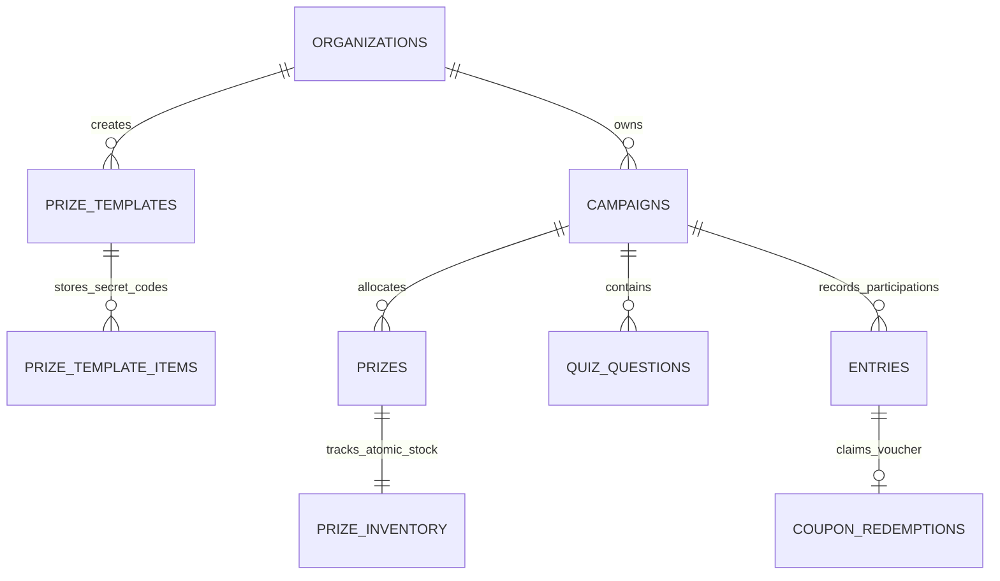

# DZENGAGE — Database, Seeding & Testing Documentation

This document serves as the complete technical reference for developers on the team. It covers local database setup, seeding realistic sample data, atomic prize draw architecture, the auto-paced daily voucher distribution engine, and in-app testing tools.

---

## 1. Quick Start & Prerequisites

### Prerequisites

- **Node.js** v20+ / v22+
- **Docker Desktop** (running for local Supabase)
- **Supabase CLI**

### Daily Workflow Commands

| Command             | Description                                                                     |
| :------------------ | :------------------------------------------------------------------------------ |
| `npm run dev`       | Starts Vite development server at `http://localhost:3000`                       |
| `npm run db:seed`   | Seeds deterministic sample campaigns, vouchers, and participant entries         |
| `npm run typecheck` | Type-checks the entire TypeScript codebase (`tsc --noEmit`)                     |
| `npm run lint`      | Runs ESLint rules across the repository                                         |
| `npm run build`     | Builds the production Vite bundle                                               |
| `npm run verify`    | Runs lint + typecheck + test + build (executed automatically by pre-push hooks) |
| `supabase db reset` | Applies all migrations from scratch and runs `seed.sql` automatically           |

---

## 2. Local Database Seeding (`npm run db:seed`)

The seed script ([`supabase/seed.sql`](../supabase/seed.sql)) runs deterministically (`setseed(0.42)`) and safely:

- **Strict Host Guardrail**: Refuses to run against non-local / production database hosts.
- **Seeds All Local Organizations**: Automatically detects your active logged-in developer account (e.g. `dz`) as well as the 2 demo organizations (`Ooredoo Algeria Demo` and `Yassir SuperApp Demo`).
- **Unified Campaign Franchise Naming**: All campaigns within each organization share a cohesive franchise name (e.g. `DZ Mega Grand Challenge — Lucky Spin Wheel`, `DZ Mega Grand Challenge — Trivia & Culture Quiz`).
- **Pre-Loaded Stock Room Codes**: Generates 630+ real secret voucher codes in `prize_template_items` (e.g., `DZ-500-0001-...`, `OOR-10GB-001-...`).
- **Realistic Dwell Times**:
  - **Lucky Wheel Plays**: Configured strictly between **`6s` and `20s`**.
  - **Trivia Quiz Plays**: Configured strictly between **`15s` and `60s`**.
- **Real Algerian Mobile Carriers**: Mobilis (`06`), Djezzy (`07`), and Ooredoo (`05`) numbers spread over a rolling 14-day timeline.

---

## 3. Database Architecture & Key RPC Functions

### 1. `draw_and_claim_campaign_prize(p_campaign_id uuid, p_quiz_passed boolean)`

- **Purpose**: Atomically executes the prize draw, checks auto-pacing daily quotas, and locks/claims inventory in a single ACID transaction.
- **Pacing Logic**:
  - Uses fixed reference timezone: **`Africa/Algiers` (UTC+1)** for midnight rollover.
  - Self-correcting daily quota formula:
    $$\text{daily\_limit\_today} = \left\lfloor \frac{\text{remaining\_quantity}}{\text{remaining\_days}} \right\rfloor$$
  - Excludes exhausted prizes for the day and renormalizes weights among remaining eligible prizes.
  - Claims inventory using `FOR UPDATE SKIP LOCKED` to eliminate race conditions under concurrent load.

### 2. `save_campaign_full_in_place(...)`

- **Purpose**: In-place campaign creation and updates without deleting active campaigns or orphaning player history.
- **Protections**:
  - Enforces quantity won floors (`requested_quantity >= quantity_won`).
  - Protects answered quiz questions with `is_active = false` instead of hard deletion.
  - Automatically records `auto_pace_enabled_at = now()` when auto-pacing is enabled mid-campaign for forward-only quota recalculation.

### 3. `get_campaign_participants(p_organization_id uuid, p_campaign_id uuid)`

- **Purpose**: Returns the full table of players with phone numbers, winners, prize names, redeemed vouchers, dwell times, and timestamps.
- **Type Safety**: Strictly casts all varchar columns to `text` to prevent Postgres `42804` errors.

---

## 4. Auto-Paced Daily Voucher Distribution

### How It Works:

1. **When Creating / Editing a Campaign**:
   - In Step 2 (Game Mechanics), toggle on **"Auto-Paced Daily Voucher Distribution"**.
   - The manual 0–100% win probability slider is locked and replaced with an **"AUTO"** badge.
   - The UI computes an instant client-side preview: $\sim X\text{ vouchers/day across } N\text{ days}$.
2. **Server-Side Enforcement**:
   - `draw_and_claim_campaign_prize` counts today's won entries for each prize in `Africa/Algiers` timezone.
   - When today's quota is reached, subsequent players receive a standard **"Khirha fi Ghirha"** outcome until the next day's quota unlocks at midnight.
3. **Mid-Flight Toggle**:
   - Turning auto-pacing on during an active campaign calculates quotas from **today forward** based on remaining un-won stock.

---

## 5. UI Testing & Player Simulation Console

You do not need to write raw SQL to test campaign mechanics. You can simulate players directly in the browser:

### Method A: In-Dashboard Test Console

1. Navigate to **Campaigns** $\rightarrow$ Open any campaign's **Workspace**.
2. Click the purple **"🧪 Simulate Plays"** button in the top action row.
3. Choose your testing mode:
   - **Interactive Single Play**: Enter a custom name and Algerian phone (or click **"🎲 Randomize"**) $\rightarrow$ click **"Execute Play"** to test the draw and inspect the server response.
   - **Bulk Test Generator**: Select 5, 10, 25, or 50 plays $\rightarrow$ choose a carrier mix $\rightarrow$ click **"Generate & Inject"** to populate the campaign. The Analytics table and charts update immediately.

### Method B: Public Player Screen (`/play/:slug`)

- Open `http://localhost:3000/play/[campaign-slug]` in your browser to play the full consumer flow (landing screen $\rightarrow$ trivia quiz $\rightarrow$ wheel spin $\rightarrow$ coupon code reveal $\rightarrow$ copy code confirmation).

---

## 6. Database Schema Reference

### `campaigns`

| Column                 | Type          | Description                                     |
| :--------------------- | :------------ | :---------------------------------------------- |
| `id`                   | `UUID`        | Primary Key                                     |
| `organization_id`      | `UUID`        | Foreign Key $\rightarrow$ `organizations.id`    |
| `name`                 | `TEXT`        | Campaign title (e.g. _DZ Mega Grand Challenge_) |
| `arabic_name`          | `TEXT`        | Arabic localization (e.g. _عجلة الحظ الكبرى_)   |
| `slug`                 | `TEXT`        | Unique URL portal slug                          |
| `status`               | `TEXT`        | `active`, `paused`, `draft`, `ended`            |
| `start_date`           | `TIMESTAMPTZ` | Campaign start timestamp                        |
| `end_date`             | `TIMESTAMPTZ` | Campaign expiration timestamp                   |
| `win_probability`      | `NUMERIC`     | Manual win rate decimal (0.00 to 1.00)          |
| `require_quiz`         | `BOOLEAN`     | `true` for Quiz, `false` for Lucky Wheel        |
| `auto_pace_prizes`     | `BOOLEAN`     | `true` when auto-pacing is enabled              |
| `auto_pace_enabled_at` | `TIMESTAMPTZ` | Timestamp when auto-pacing was toggled on       |

### `entries`

| Column                  | Type           | Description                                   |
| :---------------------- | :------------- | :-------------------------------------------- |
| `id`                    | `UUID`         | Primary Key                                   |
| `campaign_id`           | `UUID`         | Foreign Key $\rightarrow$ `campaigns.id`      |
| `phone_number`          | `VARCHAR(20)`  | Normalized Algerian phone (`05`, `06`, `07`)  |
| `participant_name`      | `VARCHAR(255)` | Player full name                              |
| `is_winner`             | `BOOLEAN`      | `true` if prize was won                       |
| `prize_id`              | `UUID`         | Foreign Key $\rightarrow$ `prizes.id`         |
| `redeemed_coupon_value` | `VARCHAR(255)` | Secret voucher code awarded                   |
| `dwell_time_seconds`    | `INTEGER`      | Time spent in game (6–20s wheel, 15–60s quiz) |
| `quiz_passed`           | `BOOLEAN`      | `true`/`false` for quiz trivia campaigns      |
| `coupon_confirmed`      | `BOOLEAN`      | Player acknowledged copying voucher code      |
| `metadata`              | `JSONB`        | Carrier, dwell time, IP city, user agent info |

---

## 7. Troubleshooting & FAQ

### 1. Why are my campaigns or prizes not showing up?

Ensure you are logged in with the organization that owns those campaigns (`organization_id`), or run `npm run db:seed` to refresh sample data for your active developer account.

### 2. Can I delete a campaign that has participant entries?

No. To preserve historical and financial audit integrity, campaigns with entries cannot be hard-deleted; archive them by setting their status to `ended` instead.

### 3. How do I test with clean data?

Run `npm run db:seed` anytime. It safely clears and repopulates sample data without wiping personal developer login accounts.
